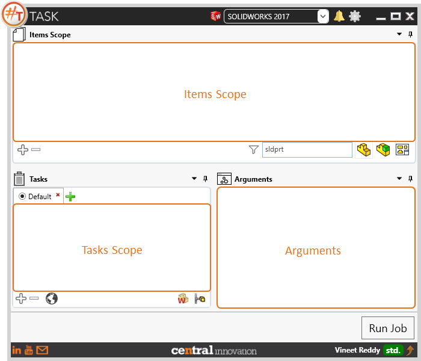
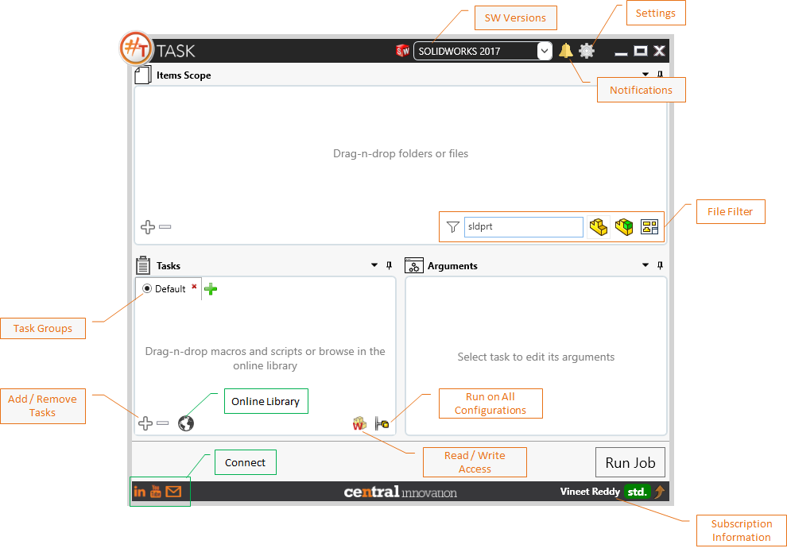
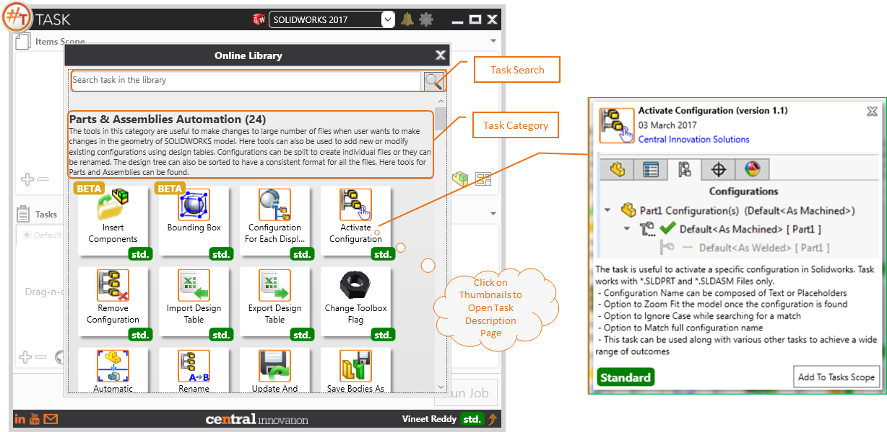
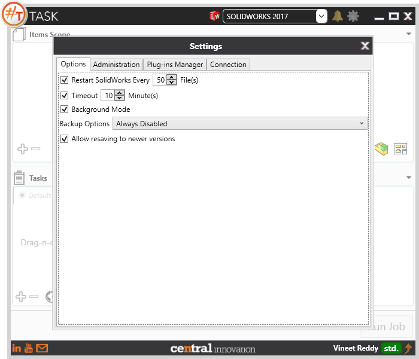
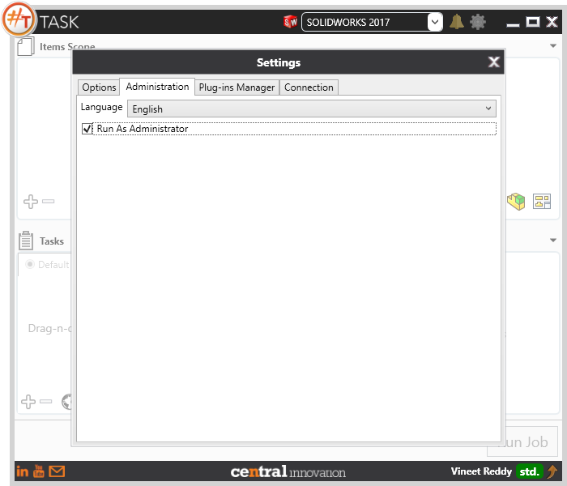
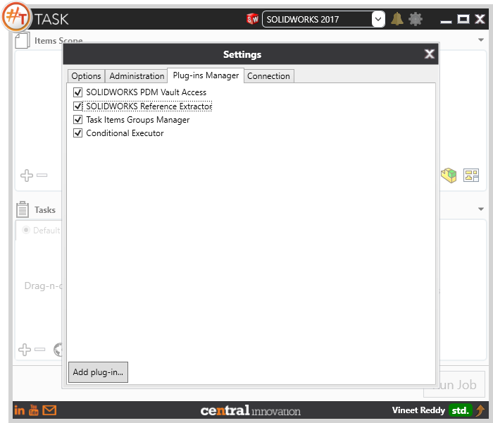
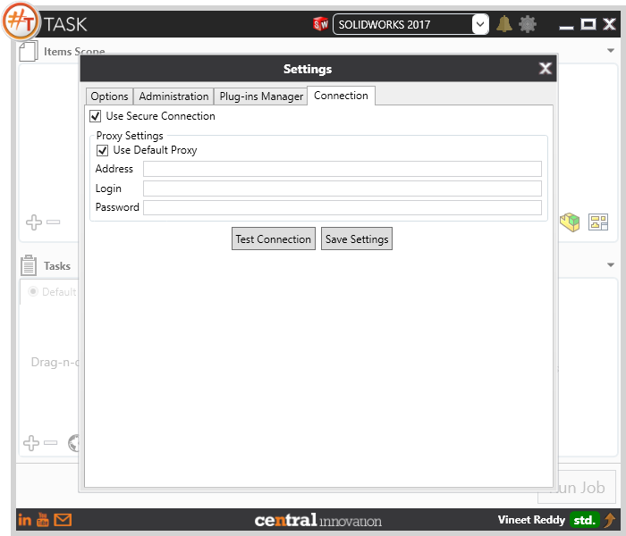

## Introduction

``#TASK`` is a application used for batch processing processing Solidworks Files.
Below sections details and introduces the user to #TASK User Inteface.

---
## Main Layout

``#TASK`` contains three main section as shown below. 

| Section | Description |
|--- |--- |
| Toolbar | Shortcuts to ``#TASK`` Settings, Notifications and Solidworks Version selector |
| Items Scope | List of files that are to to be processed using ``#TASK``. This is maximum scope of files that will be affected based on the filter settings |
| Tasks Scope | List of Tasks that are lined up for processign against the items scope |
| Arguments | Based on the selection of Task in Tasks Scope, arguments specific to the selected task are displayed |

---
## User Interface Details

User interface for ``#TASK`` contains several options as shown below.

| Label | Description |
|--- |--- |
| SW Versions | Lists the versions of Solidworks that are installed on the current system. User can select an Active Session of Solidworks or choose to initiate a new instance |
| Notification | Clicking on bell icon show the list of notifications that are listed for current user. |
| Settings | User can access ``#TASK`` Setting by clicking on the gear icon. We will be discussing more details in a different section |
| About Menu | User can check the Verions, EULA etc from this menu |
| Filters | User can set the file extension filters to define the file scope for execution. Choose using Toggle buttons for SLDPRT, SLDASM and SLDDRW or type in the extension (without ".") |
| Task List | User can add tasks into the Tasks Scope to be executed against files in Items Scope |
| Task Groups | User can save list of Tasks a Task Group by defining a Name for "Task Tab". User can define multiple Task Groups. |
| Add / Remove Tasks | User can use the + icon to add tasks (.sts,.stm,.swp or .dll files) from folders. User can choose the Task can click on "-" to remove it. |
| Library | Click on the Library Icon to open ``#TASK`` Online Library. We will be discussing more details in a different section. |
| Access | Access Toggle helps user to define the level of access that is permitted to files while being processed through ``#TASK``. Toggle between "Read Only" or "Read & Write". |
| Configuration | User can toggle setting for ``#TASK`` Session to execute on all configuration or just the active configuration. |
| Connect | Provides shortcuts to LinkedIn Group for ``#TASK``, Youtube Video Playlist for ``#TASK`` and click on the email icon to share your idea, register a bug or even suggest an enhancement request |
| Subscription Information | When user mouseover on subscription icon "std." or "pro." or "prm." details related to the registered user. Upgrade option for your subscription as well. |

---
## Online Library

User can access Tasks from Online Library by clicking on the "Online Library" icon. This will open the Online Library window in ``#TASK`` layout as below.

When Online Library is opened, all tasks within the Library are displayed in groups. Each group contains a set of tasks that compliment others within that specific group.
User can search for Tasks by specifying a keyword or even a partial search will prodive the result set showing all the tasks.

---
## Settings

User can access ``#TASK`` Setting by clicking on the "Settings" icon.

### Options

Below is a list of settings available under "Options" Tab

| Options | Description |
| --- | --- |
| Restart Solidworks Every "X" Files | Provides the user to force ``#TASK`` to restart Solidworks after "X" number of files were processed. This will help release system resources that were locked up during previous session of Solidworks |
| Timeout | Specify the Timeout settings for each file being processed. If any file take longer than this value, then ``#TASK`` will skip that file and proceed to the next in Items Scope list |
| BackGround Mode | If Checked, then ``#TASK`` will open solidworks in Background mode, which will use less of graphics and also would suppress user prompts |
| Backup Options | Allows user to choose from a drop down list of values to specify how the Backup should be taken for files that are processed through ``#TASK``. It is Recommended that user always set this option to "Always enabled". |
| Values in Dropdown | Other options available are "Ask for each Job","Always Enabled", and "Always Disabled"|
| Allow resaving to Newer Versions | When Checked, ``#TASK`` will save the file to the Solidworks Verison that is selected in the Toolbar / SW Version Selector. When unchecked, any file that was created in older version compared to the one select in SW Version will not be saved to newer version |

### Administration

User can setup ``#TASK`` Applicaiton to use the following settings. Note: Any change in the setting in this section will require ``#TASK`` to be restarted.

| Options | Description 
| --- | --- |
| Language | Choose between "English" or "Russian" |
| Run as Administrator | When checked, ``#TASK`` will be executed with elevated permissions. |

### Plugins Manager

| Plugin Name | Description |
| --- | --- |
| Solidworks PDM Vault Access | Provides the Check-In and Check-Out Capability along with the User credentials for Login |
| Solidworks Reference Extractor| Allows to Extract the Reference Tree for the Selected Solidworks Assembly or Solidworks Drawing File |
| Task Items Groups Manager| Enables the Task Groups Feature in ``#TASK`` User Interface. |
| Conditonal Executor | Enables a Application Level Argument field for each Tasks that is selected. User can specify the conditon to execute to task. |

### Connection

This tab allows user to specify the Proxy Settings for connecting to ``#TASK`` Server from behind a firewall and proxy server.
When a Proxy Server is setup, user can sepcify the address of the Proxy server, along with Login and Password.

| Commands | Description |
| -- | --- |
| Test Connection | Provides user with an option to check for the connection based on the setting in the setting fields |
| Save Setting | Allows for saving the setting specified in connection tab |

