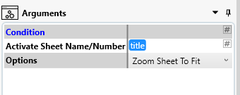

## Introduction

Within the scope of ```#TASK```, Placeholders play a vital role. These are the dynamics variables that are populated during a job run. With the availibility of placeholders during the job run, a lot of scenarios are catered.

For example, 

```gherkin
Scenario: Save Solidworks Drawing as PDF while fetching filename from Part Number custom property
    Given Solidworks Drawing Files are added into Items Scope
    And Save to PDF Task is added to Tasks list
    And Filename is set to use "Part Number" custom property
    When User clicks on "Run Job"
    Then PDF files are produced in Output folder with Filename as Part Number featched from each Solidworks Drawing File

```

## List of Placeholders


Following are the list of Placeholders available through #TASK Application as a platform feature.

### 1. Current Date


### 2. Script


### 3. Regular Expression


### 4. Vertical Table lookup


### 5. Datasource


### 6. Custom Property value


### 7. Solidworks Model Title



### 8. Solidworks Active Model Configuration or Sheet Name


### 9. Solidworks Model Part Number


### 10. Solidworks File Location


### 11. Compare


