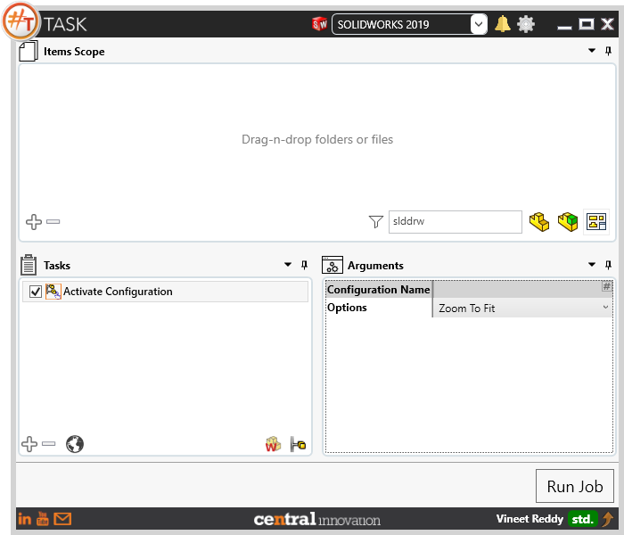
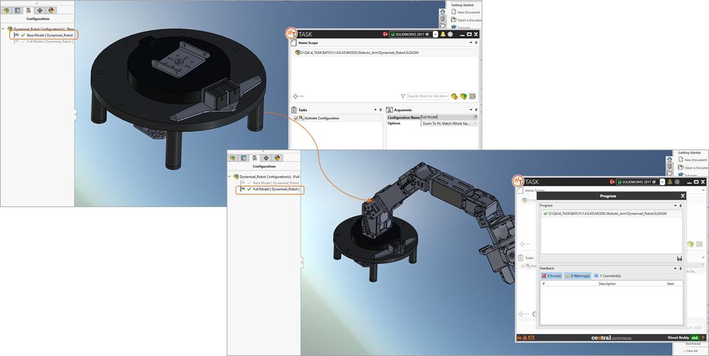

## About



Activate Configuration task should be used when user needs to activate / ensure that a desired Configuration within Solidworks Assembly / Solidworks Part file is to be activated. 

A comparative view of a model processed using Activate Configuration task is shown below.



## File Types

| Supported | Description |
| --- | --- |
| SLDPRT | Supports SolidWorks Part Files |
| SLDASM | Supports SolidWorks Assembly Files |

## Download & Task Setup

User can download this task from online library performing search using keywords.
Select the task in Tasks list and setup arguments as required.

| Argument | Details |
| --- | --- |
| Configuration Name| Enter name of configuration which needs to be activated  |
| Options | User can select one or more options from pick list |
| Zoom to Fit | Sets the model to fit within SolidWorks layout. Similar to using ```Shortcut Key "F"``` within SolidWorks |
| Ignore Case | Sets Search to be case insensitive |
| Match Whole Word | When checked, full text present in Configuration Name field should match in SolidWorks model |

Click on "Run Job" to initiate.

Once Job is completed, the target configuraiton is activated.

Below is a video of demonstrating Activate Configuration Task in usage

<video width="720" height="480" controls>
  <source src="001_ActivateConfiguration.swf" type="video/mp4">
</video>


## Download Sample Files

Sample files can be downloaded from 
[Sample Model in Solidworks 2017](../000-model/SolidWorks_2017_RoboticArm.zip)

[Click to view the model at GrabCad](https://grabcad.com/library/5-dof-robot-1)