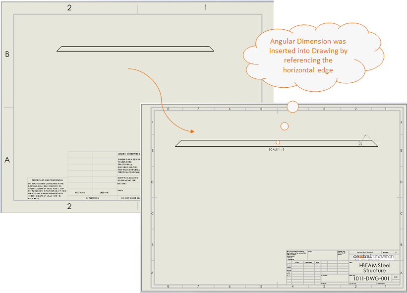

## Task Description

This task helps in inserting angular dimensions between the horizontal and extreme edge keeping horizontal edge as a reference.
- Drawing views containing Solidworks Parts are processed where as views containing Solidworks Assemblies are ignored
- Values are calculated and decimal places are assigned using document units  (Options/Document Properties/Units/Decimals)
- It does not identify dimension if they are already present
- Axonometric views like Isometric, Dimetric and Trimetric will be ignored

## File Types

| Supported | Description |
| --- | --- |
| SLDDRW | Supports SolidWorks Drawing Files only |

## Download & Task Setup

User can download this task from online library performing search using keywords.

Steps:

* Add / Drag Folder(s) / File(s) into Items Scope
* Set the filter to process SolidWorks Drawing Files
* Ensure that the Task "Add Angular Dimensions" is ticked in Tasks Scope

Click on "Run Job" to initiate.

Once Job is completed, angular dimensions are inserted against solidworks parts within drawing views

Below is a video of demonstrating activate sheet task in usage

<video width="720" height="480" controls>
  <source src="002_ActivateSheet.swf" type="video/mp4">
</video>

## Download Sample Files

Sample files can be downloaded from 
[Sample Model in Solidworks 2017](../000-model/SolidWorks_2017_RoboticArm.zip)

[Click to view the model at GrabCad](https://grabcad.com/library/5-dof-robot-1)

