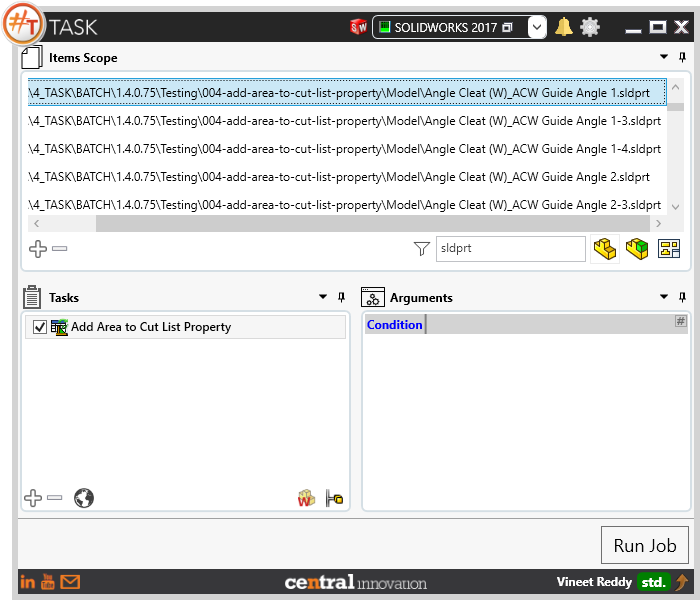
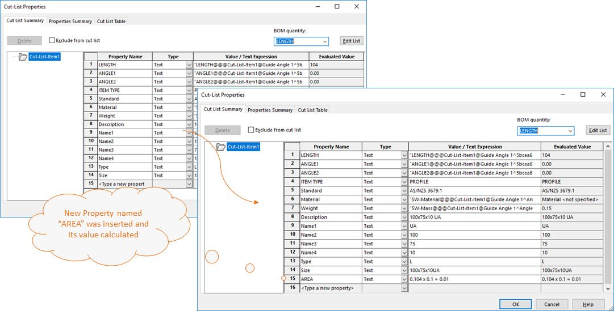

## Task Description

This task processes Solidworks Part files to generate a new property named 'Area' and assigns a calculated value as text into cut list properties table.
- Processes Solidworks Parts with Cut list.
- Units are specified in metre square m^2.
-  Area is calculated based on the two largest dimensions of the Cut list body.
The 'Area' property can be used to drawing Cut list to provide additional information about the bodies in the model.

A comparative view of a part processed using this task is shown below.

## File Types

| Supported | Description |
| --- | --- |
| SLDPRT | Supports SolidWorks Part Files only |

## Download & Task Setup

User can download this task from online library performing search using keywords.

This task does not have any arguments

Click on "Run Job" to initiate.

Once Job is completed, access cutlist properties in Solidworks to ensure that Area property exists.

Below is a video of demonstrating activate sheet task in usage

<video width="720" height="480" controls>
  <source src="002_ActivateSheet.swf" type="video/mp4">
</video>

## Download Sample Files

Sample files can be downloaded from 
[Sample Model in Solidworks 2017](../000-model/SolidWorks_2017_RoboticArm.zip)

[Click to view the model at GrabCad](https://grabcad.com/library/5-dof-robot-1)
