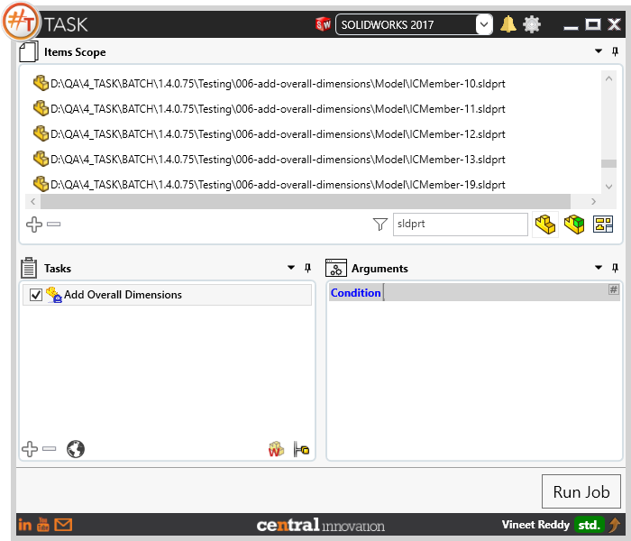
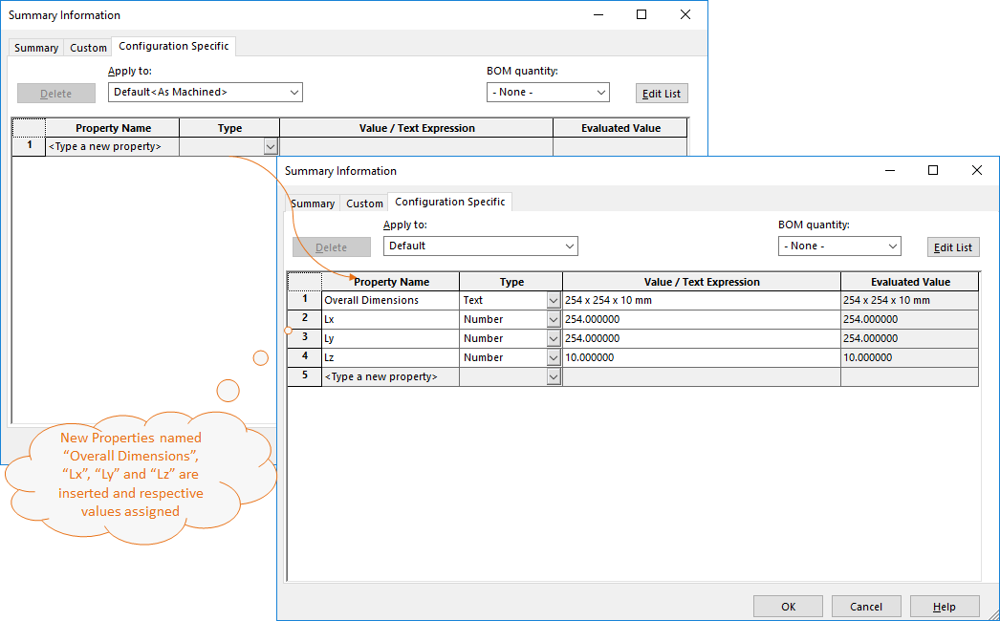

## Task Description

The task helps in capturing and storing bounding box dimensions of the model present in a Part or Assembly File. 
- Stored as properties against the respective configuration names.
- The property names are captured as Overall Dimensions, Lx, Ly and Lz. Here the Lx, Ly and Lz are the Dimensions measured along X, Y and Z axis. 
- Values are saved as static text and will not be update if the model is changed. The task should be re-run to update the values that are already present.
- The Units specified against these values are captured from the document units.

A comparative view of a drawing processed using Activate Sheet task is shown below.

## File Types

| Supported | Description |
| --- | --- |
| SLDPRT | Supports SolidWorks Part Files |
| SLDASM | Supports SolidWorks Assembly Files |

## Download & Task Setup

User can download this task from online library performing search using keywords.
This task does not have specific arguments for the user to fill.

Step 1: User can select the files in Items Scope.

Step2: Click on "Run Job" to initiate.

Step 3: Upon completion of Job Run, ensure that overall dimensions are present against custom properties for each Solidworks file

Below is a video of demonstrating activate sheet task in usage

<video width="720" height="480" controls>
  <source src="002_ActivateSheet.swf" type="video/mp4">
</video>

## Download Sample Files

Sample files can be downloaded from 
[Sample Model in Solidworks 2017](../000-model/SolidWorks_2017_RoboticArm.zip)

[Click to view the model at GrabCad](https://grabcad.com/library/5-dof-robot-1)
