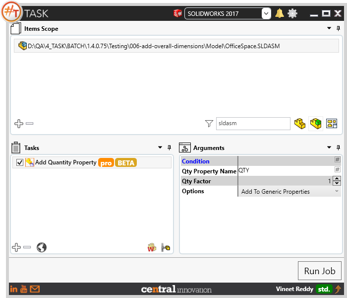
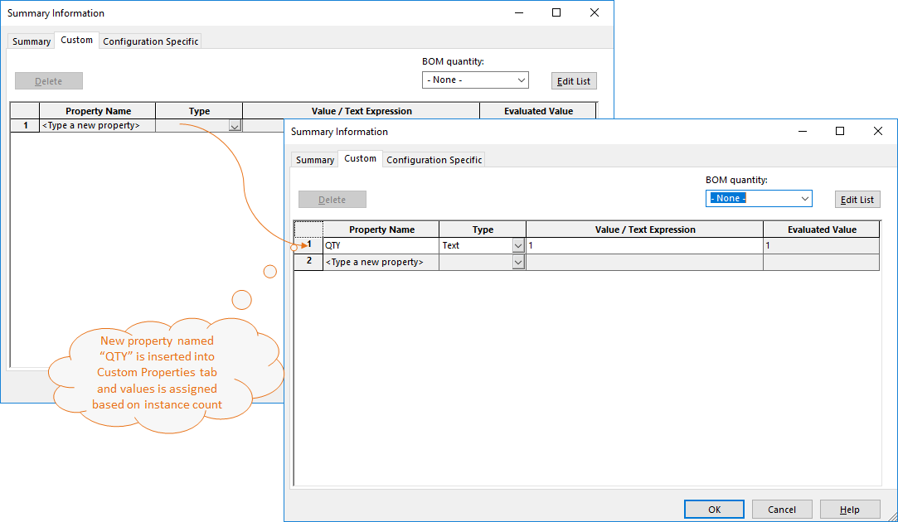
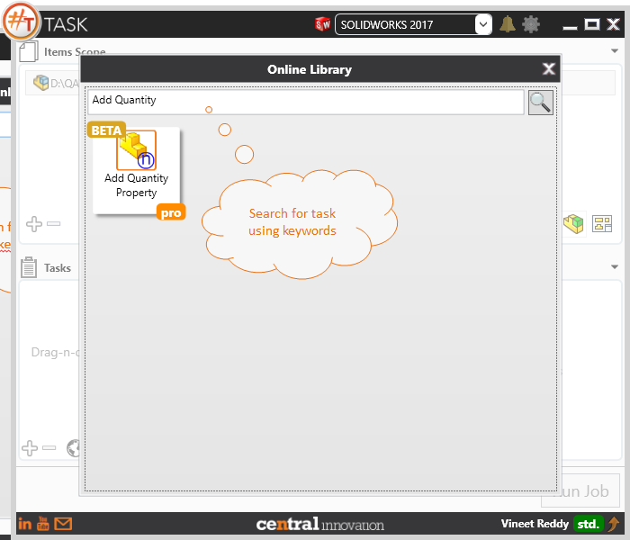

## Task Description

Adds a "Quantity" property for each component in assembly, including all components in subassemblies.
By default task does not calculate excluded from BOM and suppressed components. They could be added in task options. 

 - Toolbox components are ignored. 
 - Task calculates the components on in all subassemblies but an option could be chosen to calculate components only on top level. 
 - If previously the property with quantity was added then user has an option to append newly calculated quantity to existing property. 
 - Task has an option to duplicate the property for all derived configurations which is useful for sheet metal and weldment components. 
 - Task works with SolidWorks assembly documents [*.SLDASM]

A comparative view of a drawing processed using Activate Sheet task is shown below.

## File Types

| Supported | Description |
| --- | --- |
| SLDASM | Supports SolidWorks Assembly Files |

## Download & Task Setup

User can download this task from online library performing search using keywords.

Select the task in Tasks list and setup arguments as required.

| Argument | Details |
| --- | --- |
| Qty Property Name | Specify custom property name to be created using this task. Default is "QTY" |
| Qty Factor                      | Factor by which calculated quantity value should be multiplied |
| Options | Dropdown containing various options for this task |
| Add to Generic Properties | Creates new property and assigns value to Custom Properties Tab |
| Add to Active Configuration | Creates new property and assigns value to Active Configuration Tab |
| Add to All Configurations | Creates new property and assigns value to all available configurations |
| Add to Dependent Configuration | Creates new property and assigns value to Custom Properties for Dependent configuration |
| Count Suppressed Components | Suppressed Instances of component are taken into account |
| Count Excluded from BOM | Instances that are excluded from BOM are taken into account |
| Count Top level components only | Considers only Top level components |
| Append to Existing Quantity | Add to the existing value of Custom Property |

Click on "Run Job" to initiate.

Once Job is completed, the target sheet is activated.

Below is a video of demonstrating activate sheet task in usage

<video width="720" height="480" controls>
  <source src="002_ActivateSheet.swf" type="video/mp4">
</video>

## Download Sample Files

Sample files can be downloaded from 
[Sample Model in Solidworks 2017](../000-model/SolidWorks_2017_RoboticArm.zip)