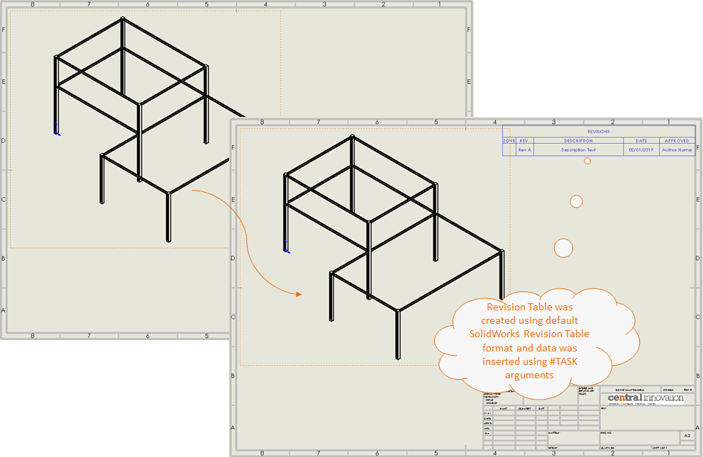

## Task Description

This task can be used to add a Row of data into a Revision Table. 
- Data will be inserted on the active Drawing Sheet.
- User can optionally set to ""Run macro on each configuration"" if they need revision table on each sheet
- If Revision table is not present, then both table and data will be inserted

A comparative view of a drawing processed using "Add Revision" task is shown below.

## File Types

| Supported | Description |
| --- | --- |
| SLDDRW | Supports SolidWorks Drawing Files only |

## Download & Task Setup

User can download this task from online library performing search using keywords.

Select the task in Tasks list and setup arguments as required.

| Argument | Details |
| --- | --- |
| Revision Table Row | Enter data to be inserted into revision table in the format as applicable to the Revision Table format being selected |
| OX Distance | Offset distance on X-Axis from top left corner |
| OY Distance | Offset distance on X-Axis from top left corner in document units |
| Template (.sldrevtbt) | Full path to Solidworks Revision Table template file (along with extension). |

Click on "Run Job" to initiate.

Once Job is completed, verify the changes in the target file.

## Download Sample Files

Sample files can be downloaded from 
[Sample Model in Solidworks 2017](../000-model/SolidWorks_2017_RoboticArm.zip)

[Click to view the model at GrabCad](https://grabcad.com/library/5-dof-robot-1)
