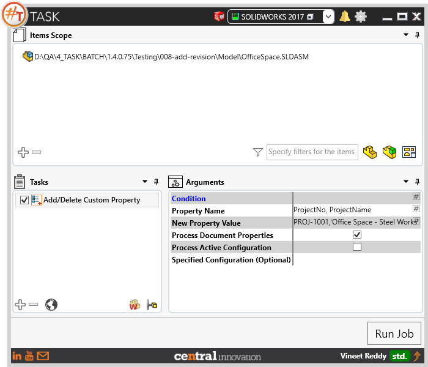
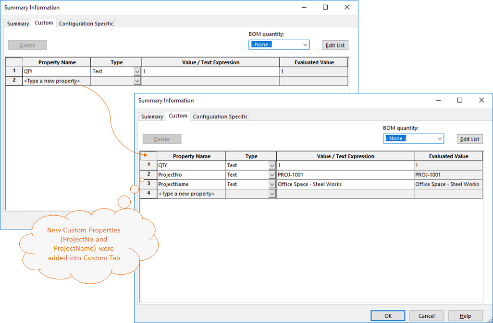

## Task Description



Task can be used to Add or Remove or Rename custom and/or configuration properties. 
 - Macro uses the "Find and Replace" method.
 - When same 'Property Name' is found, it replace existing value by "New Property value"
 - Can process Solidworks Part, Assembly and Drawing files.
 - Provides option to choose to process Document or Configuration Property
 - Provides user with option to Remove property name as place holders
Example: 
 - Use -Revision to Delete 'Revision' from Properties by searching through Document and Configuration(s).
 - Use -* to Remove All Custom Properties from the files.

A comparative view of files processed using Add / Delete Custom Property task is shown below.



## File Types

| Supported | Description |
| --- | --- |
| SLDPRT | Supports SolidWorks Part Files  |
| SLDASM | Supports SolidWorks Assembly Files |
| SLDDRW | Supports SolidWorks Drawing Files |


## Download & Task Setup

User can download this task from online library performing search using keywords.


Select the task in Tasks list and setup arguments as required.

| Argument | Details |
| --- | --- |
| Property Name | Enter name of Sheet which needs to be activated. Alternatively, a sheet number can be specified |
| New Property Value | User can select one or more options from pick list |
| Process Document Properties | When Checked The above Property Name and Property Value will be inserted into Custom Tab |
| Process Active Configuration | When Checked The above Property Name and Property Value will be inserted into Active Configuration Tab. And when "Run on all Configurations" toggle is set, the property name and values will be inserted into each configuration |
| Specified Configuration (Optional) | When property and value are to be inserted into a specific configuration only, then user can specify a Configuration Name and process the task |


Click on "Run Job" to initiate.

Once Job is completed, New Properties along with their assigned values should be available in Properties Manager within SolidWorks.


## Scenario

```gherkin
Scenario: Add Custom Properties into Solidworks Files in batch mode
	Given Solidworks Native files are added into Items Scope
	And User has setup the Arguments to add new custom properties
	When user clicks on "Run Job"
	Then #TASK processes the macro and custom properties are inserted into target files
```

## Video

Below is a video of demonstrating activate sheet task in usage

<video width="720" height="480" controls>
  <source src="002_ActivateSheet.swf" type="video/mp4">
</video>


## Download Sample Files

Sample files can be downloaded from 
[Sample Model in Solidworks 2017](../000-model/SolidWorks_2017_RoboticArm.zip)

[Click to view the model at GrabCad](https://grabcad.com/library/5-dof-robot-1)
