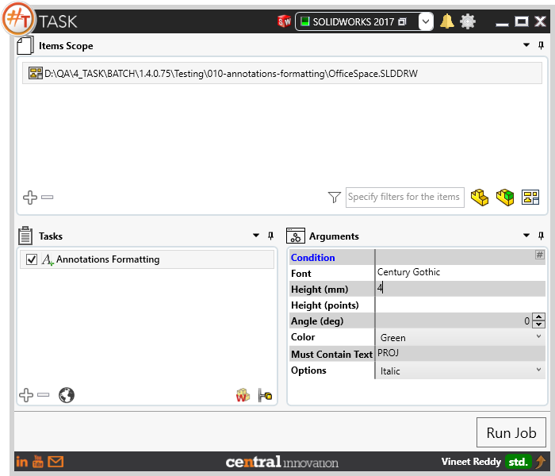
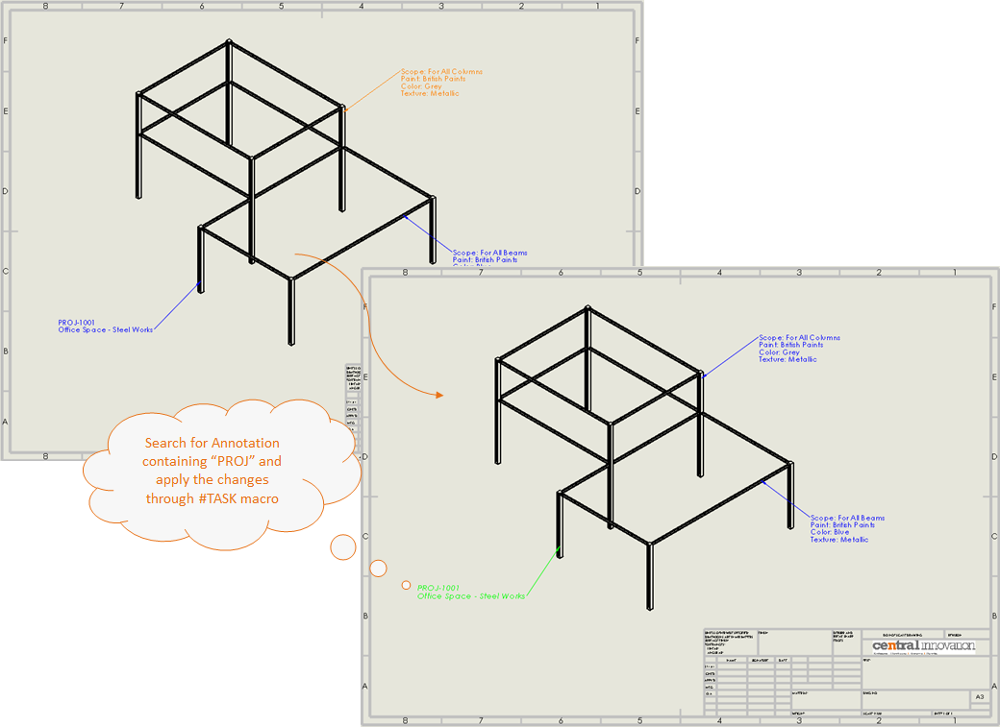
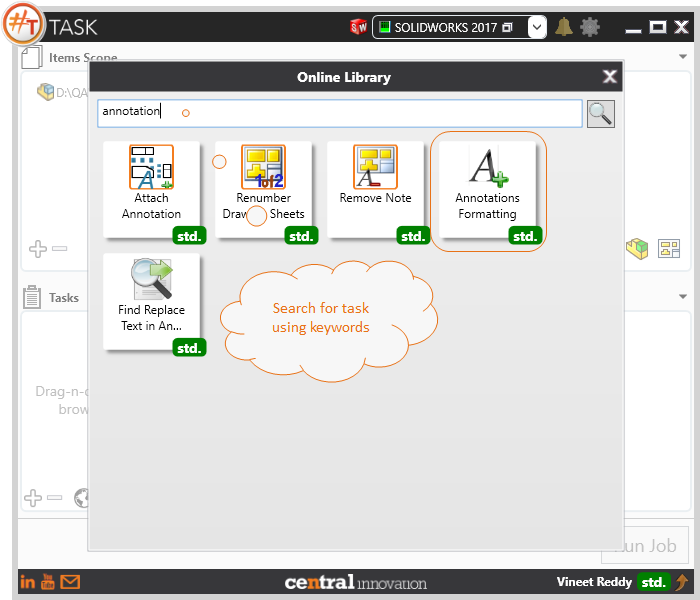

## Task Description

Use this task to change the format of text used in Solidworks Drawings.
It provides the user with options to 
 - Specify or change the font to be used in Solidworks Drawing File
 - Specify or change the font height (mm)
 - Specify or change the font height (points)
 - Specify or change the Angle (deg)
 - Specify or change the Color
 - Filter text by its contents 'Must Contain Text'
 - Options to change to Italic, Bold or Underlined
This task is useful to insert or bulk edit to update the annotation format in existing drawings 

A comparative view of a drawing processed using Activate Sheet task is shown below.

## File Types

| Supported | Description |
| --- | --- |
| SLDDRW | Supports SolidWorks Drawing Files only |

## Download & Task Setup

User can download this task from online library performing search using keywords.

Select the task in Tasks list and setup arguments as required.

| Argument | Details |
| --- | --- |
| Font | Specify font name to be applied. Should match the font name from SolidWorks fonts library |
| Height (mm) | Set a value for font height in millimeters |
| Height (points) | Set a value for font height in points. Note user should set the height using one of two argument only (not both) |
| Angle (deg) | Angle for orientation in degrees |
| Color | Select the target color from predefined list |
| Must Contain Text | Provides an option to filter annotations present in drawing using Keyword Search |
| Options | User can choose to set the fonts to be Bold, Italic and / or Underlined. |

Click on "Run Job" to initiate.

Once Job is completed, the target drawing file will have the changes made to the annotations as per settings in arguments.

Below is a video of demonstrating activate sheet task in usage

<video width="720" height="480" controls>
  <source src="002_ActivateSheet.swf" type="video/mp4">
</video>

## Download Sample Files

Sample files can be downloaded from 
[Sample Model in Solidworks 2017](../000-model/SolidWorks_2017_RoboticArm.zip)

[Click to view the model at GrabCad](https://grabcad.com/library/5-dof-robot-1)
