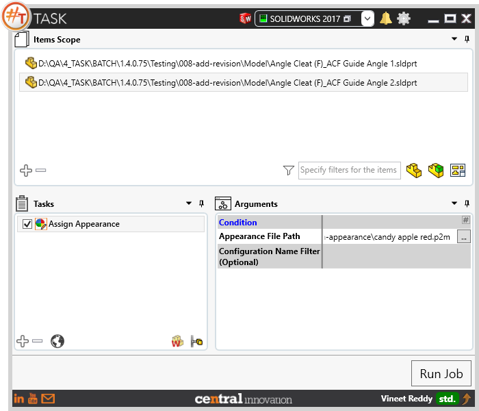
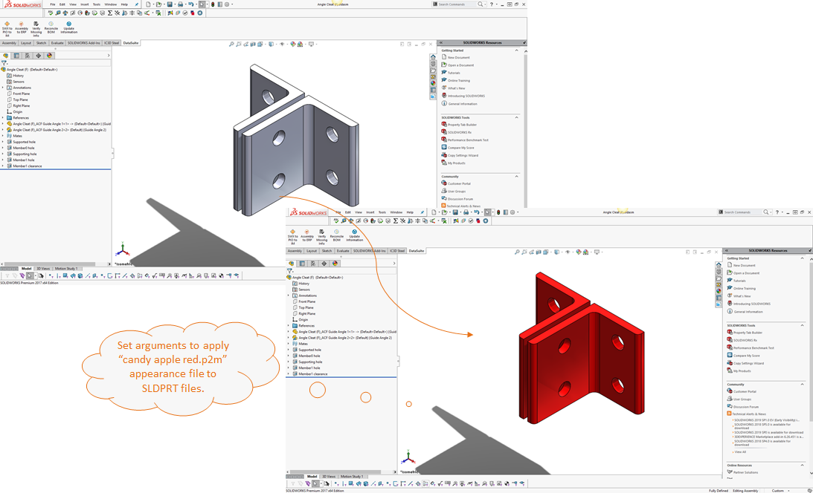
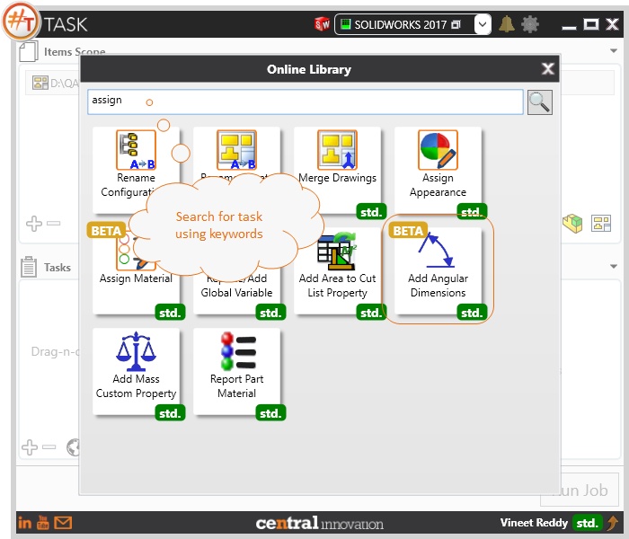
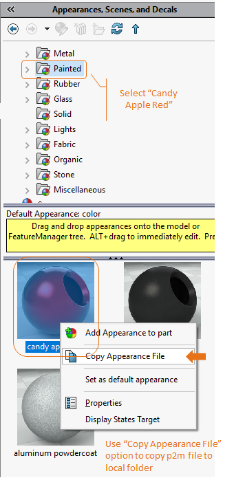

## Task Description



This task can be used to assign appearance to Solidworks part and assemblies using "*.p2m" template. 
 Below are some points to note:
 - By default, appearance is applied to active configuration only
 - Enable "Run macro on each configuration" to apply new appearance for each configuration
 - User has to specify the path to p2m, file using browse file control or can consist of text
 - User can specify configuration names to which the setting has to be applied


A comparative view of a drawing processed using Activate Sheet task is shown below.



## File Types

| Supported | Description |
| --- | --- |
| SLDPRT | Supports SolidWorks Part Files only |


## Download & Task Setup

User can download this task from online library performing search using keywords.



Appearance file can be copied from Solidworks as shown below



Select the task in Tasks list and setup arguments as required.

| Argument | Details |
| --- | --- |
| Appearance File Path | Full File path to p2m file which contains the required appearance. For example: ```"D:\candy apple red.p2m"``` |
| Configuration Name Filter (Optional) | User can select one or more options from pick list |


Click on "Run Job" to initiate.

Once Job is completed, selected appearance will be set against the target Solidworks part files.

Below is a video of demonstrating activate sheet task in usage

<video width="720" height="480" controls>
  <source src="002_ActivateSheet.swf" type="video/mp4">
</video>


## Download Sample Files

Sample files can be downloaded from 
[Sample Model in Solidworks 2017](../000-model/SolidWorks_2017_RoboticArm.zip)

[Click to view the model at GrabCad](https://grabcad.com/library/5-dof-robot-1)
