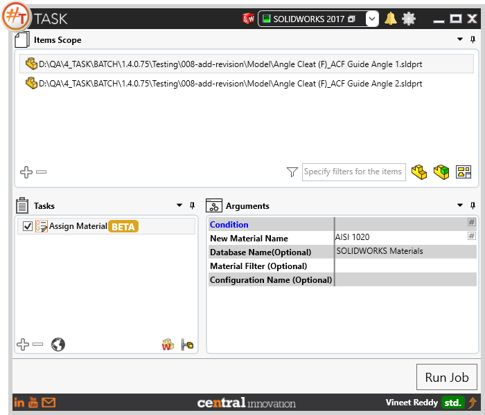
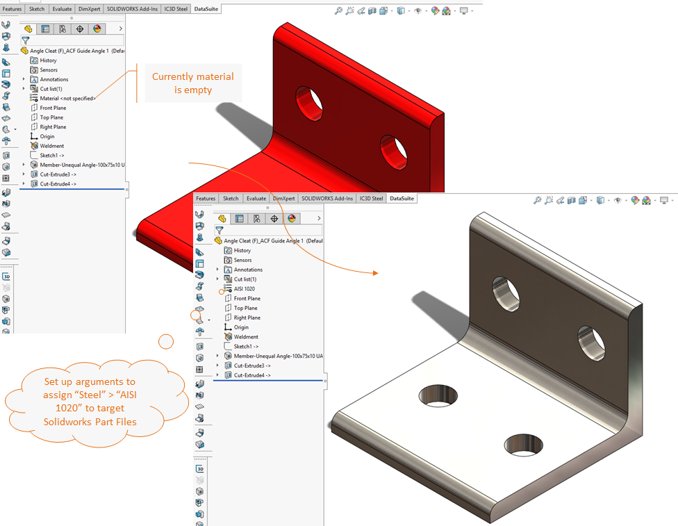
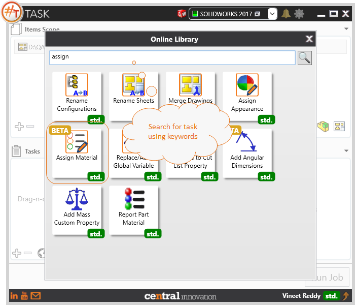
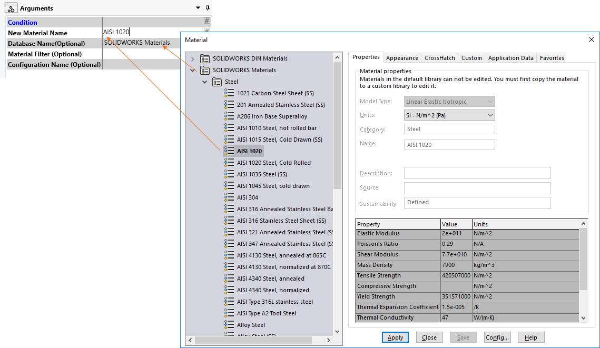

## Task Description

The task provides the flexibility to assign material to Solidworks Parts. 
 - Any assigned material can be replaced by a new material
 - Specified material can be replaced by a new material
 - Only considers Solidworks Parts that are assigned with a Material
 - Material can be assigned to the whole part or specific configuration
 - Material should exist in material database, while Database name should be unique.

A comparative view of a drawing processed using Activate Sheet task is shown below.

## File Types

| Supported | Description |
| --- | --- |
| SLDPRT | Supports SolidWorks Part Files only |

## Download & Task Setup

User can download this task from online library performing search using keywords.

Material names in Solidworks material library can be looked up as shown below to avoid any errors.

Select the task in Tasks list and setup arguments as required.

| Argument | Details |
| --- | --- |
| New Material Name | Enter name of Sheet which needs to be activated. Alternatively, a sheet number can be specified |
| Database Name (Optional) | User can specify the Database name from where the new material should be selected and assigned. Default value is set to "SOLIDWORKS Materials" |
| Material Filter (Optional) | When an existing material needs to be replaced with a new material name then user should specify the current material name in this field as a filter |
| Configuration Name (Optional) | If material needs to be assigned for a specific configuration, then specify the configuration name |

Click on "Run Job" to initiate.

Once Job is completed, selected material should be assigned to target Solidworks Part files.

Below is a video of demonstrating activate sheet task in usage

<video width="720" height="480" controls>
  <source src="002_ActivateSheet.swf" type="video/mp4">
</video>

## Download Sample Files

Sample files can be downloaded from 
[Sample Model in Solidworks 2017](../000-model/SolidWorks_2017_RoboticArm.zip)

[Click to view the model at GrabCad](https://grabcad.com/library/5-dof-robot-1)
