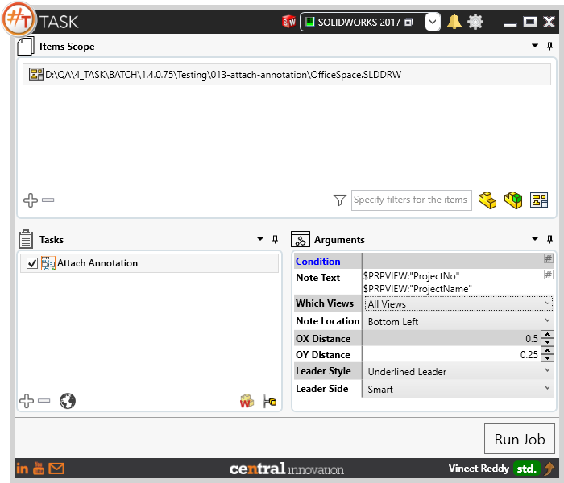
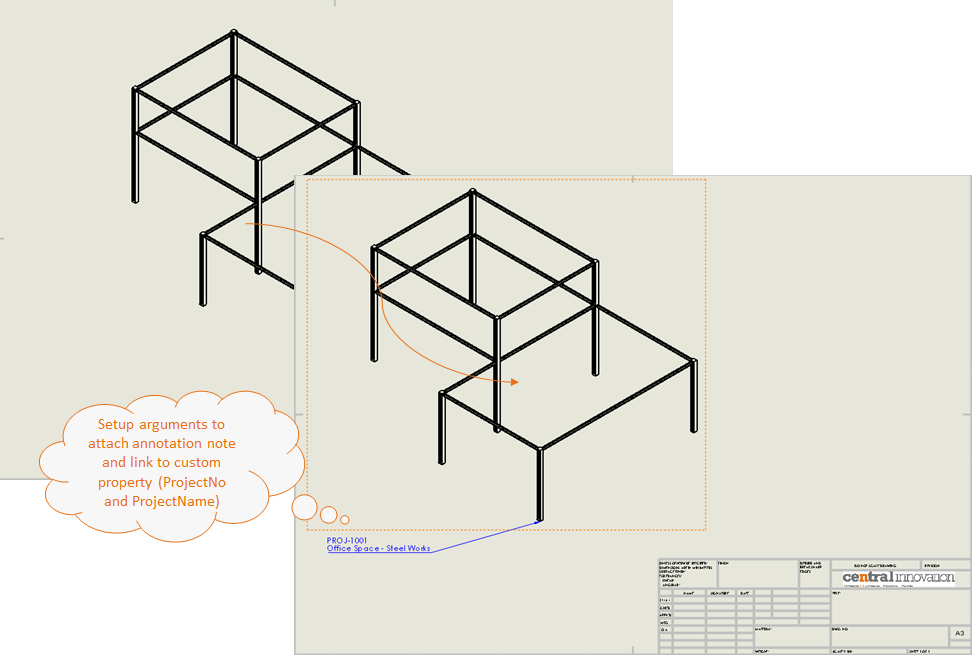
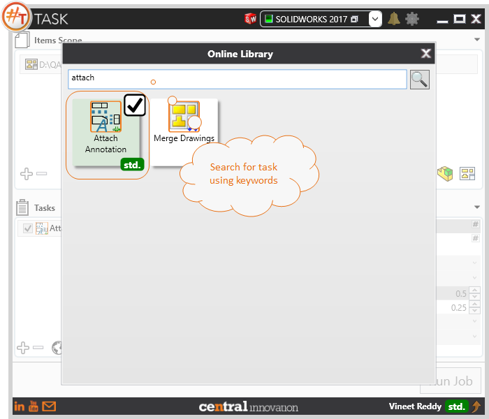

## Task Description



This task produces Annotations attached to Drawing Views. 
 - Annotation can be composed of Text
 - Can use placeholders like Current Date, Custom Property Value, Solidworks Active Configuration Name,  Referenced Model Configuration Name, SW Model Title, Referenced  Model Title, Referenced Model Path
 - Which View: User can Select Specific Views to attach Annotation
 - Choose a reference location to place the note related to the Drawing View
 - Specify X and Y Offset distance with respect to Drawing View box.
 - Choose the Leader Style to use
 - Leader Side: user can choose to align the Leader Side towards Right / Left or Smart"


A comparative view of a drawing processed using Activate Sheet task is shown below.



## File Types

| Supported | Description |
| --- | --- |
| SLDDRW | Supports SolidWorks Drawing Files only |


## Download & Task Setup

User can download this task from online library performing search using keywords.



Select the task in Tasks list and setup arguments as required.

| Argument | Details |
| --- | --- |
| Note Text | Specify the Text content for Annotation. Following prefix can be used ```$PRP, $PRPSHEET,$PRPVIEW and $PRPMODEL``` to link custom properties. |
| Which Views | User can select one or more view types from drop down pick list. This will filter the views to which the annotations are to be attached. |
| Note Location | Choose a location from drop down list to locate the origin relative to the drawing view |
| OX Distance   | Specify X-axis distance value in Document Units |
| OY Distance   | Specify Y-axis distance value in Document Units |
| Leader Style  | Choose a Style for leader from drop down list. Choose from ```No Leader, Straight, Multi Jogged, Underlined, Spline``` |
| Leader Side   | Choose to align leader to Left, Right, or Smart (use nearest side) |

Below table shows the options present to filter the views to which the annotations should be applied during  a job run

| Which Views              | Description                                                  |
| ------------------------ | ------------------------------------------------------------ |
| All Views                | Applies to all views in drawing file                         |
| Is Sheet Metal           | Applies to views containing Sheet Metal components           |
| With Referenced Assembly | Applies to views containing Solidworks Assembly              |
| With Reference Part      | Applies to views containing Solidworks Part                  |
| First View in Tree       | Applies to First View in SolidWorks Feature Manager Design Tree in drawing environment |
| Alternate Position Views | Applies to Views of type Alternate Position                  |
| Auxiliary Views          | Applies to Views of type Auxiliary Position only             |
| Detached Views           | Applies to Detached Views only                               |
| Detailed Views           | Applies to Views of type Detailed                            |
| Named Views              | Applies to Views of type Named                               |
| Standard Views           | Applies to Views of type Standard                            |
| Projected Views          | Applies to Projected views only                              |
| Relative Views           | Applies to Relative views only                               |
| Section Views            | Applies to Section views only                                |

Click on "Run Job" to initiate.

Once Job is completed, annotations should be present in SolidWorks Files with text content as setup in arguments.

Below is a video of demonstrating activate sheet task in usage

<video width="720" height="480" controls>
  <source src="002_ActivateSheet.swf" type="video/mp4">
</video>


## Download Sample Files

Sample files can be downloaded from 
[Sample Model in Solidworks 2017](../000-model/SolidWorks_2017_RoboticArm.zip)

[Click to view the model at GrabCad](https://grabcad.com/library/5-dof-robot-1)
