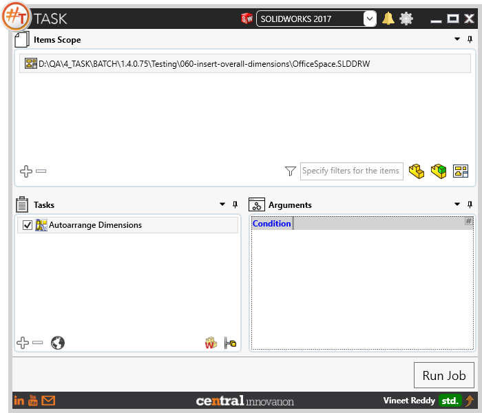
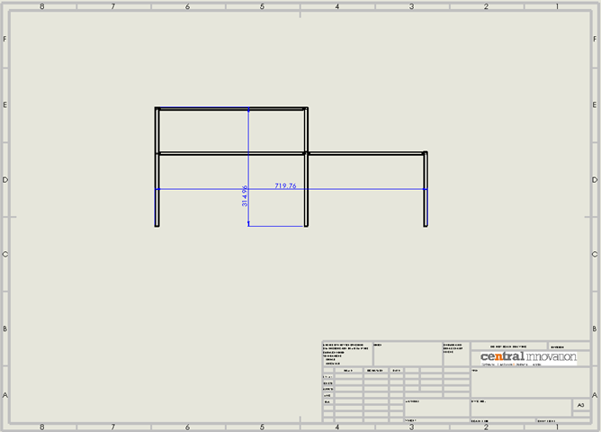

## Task Description

This task allows the user to arrange the dimensions in Solidworks Drawing files. This can be used after user has processed the files through automatic dimensioning.
 - User should have dimensions in the drawing files
 - Choosing 'Run on all configurations' executes on all sheets.
 - Outcome is similar to using Tools> Align > Auto Arrange
 - Files being processed should be in write mode.

A comparative view of a drawing processed using Activate Sheet task is shown below.

## File Types

| Supported | Description |
| --- | --- |
| SLDDRW | Supports SolidWorks Drawing Files only |

## Download & Task Setup

User can download this task from online library performing search using keywords.

This task does not have any arguments.

Click on "Run Job" to initiate.

Once Job is completed, the target Solidworks drawing file should have dimensions auto arranged.

Below is a video of demonstrating activate sheet task in usage

<video width="720" height="480" controls>
  <source src="002_ActivateSheet.swf" type="video/mp4">
</video>

## Download Sample Files

Sample files can be downloaded from 
[Sample Model in Solidworks 2017](../000-model/SolidWorks_2017_RoboticArm.zip)

[Click to view the model at GrabCad](https://grabcad.com/library/5-dof-robot-1)
