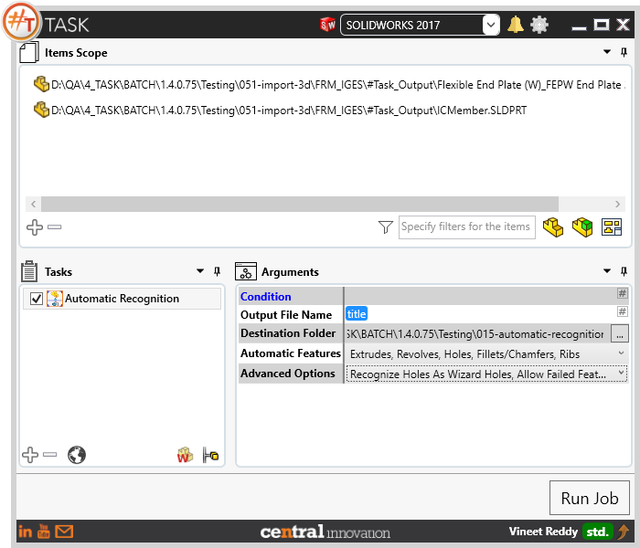
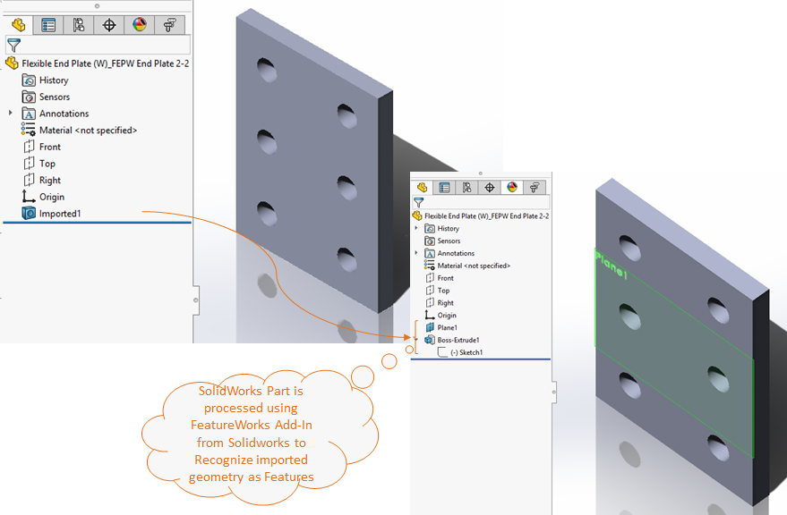
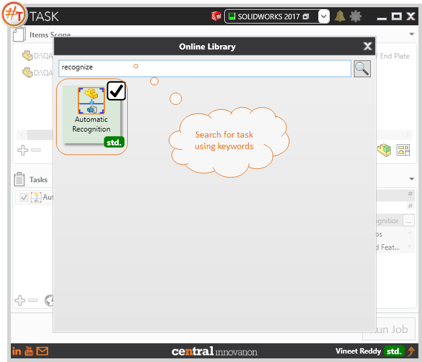

## Task Description

This task launches featureworks for automatically recognise the imported geometry.
 - User can preselect setting for automatically recognizing features
 - Can process both single and multibody geometry
 - FeatureWorks Add-In should be present and be enabled in SolidWorks Add-ins
 - Task works for Solidworks Parts only

A comparative view of a drawing processed using Activate Sheet task is shown below.

## File Types

| Supported | Description |
| --- | --- |
| SLDPRT | Supports SolidWorks Part Files |

## Download & Task Setup

User can download this task from online library performing search using keywords.

Select the task in Tasks list and setup arguments as required.

| Argument | Details |
| --- | --- |
| Output File Name | Enter plain text as file name or choose a placeholder like `title` from placeholders menu by clicking on `#` |
| Destination Folder | Specify a folder path to save output files |
| Automatic Features | Choose from a list of feature to recognize automatically during execution |
| Advanced Options | Additionally specify the behavior for sketch constraints, holes as well as failed features recognized during execution |

### List of features to recognize for Normal Solidworks Models: 

When processing Imported geometry that contains non sheet metal geometry, table below shows a valid set of features that can be processed against such components

| Features to Recognize | Resolved Feature Name                                        |
| --------------------- | ------------------------------------------------------------ |
| Extrudes              | Boss-Extrude                                                 |
| Volumes               | Boss-Thicken, Cut-Thicken                                    |
| Revolves              | Standard Revolve feature                                     |
| Holes                 | Simple Holes. To recognize Hole wizard holes, choose from *Advanced Options* |
| Fillets / Chamfers    | Standard Fillets / Chamfers along with variable radius fillets |
| Ribs                  | Standard Rib feature                                         |

### List of features to recognize for Sheetmetal Components: 

When processing Imported geometry that contains sheet metal geometry, table below shows a valid set of features that can be processed against such components

| Features to Recognize | Resolved Feature Name           |
| --------------------- | ------------------------------- |
| Edge Flange           | Standard Sheetmetal Edge Flange |
| Hem                   | Standard Sheetmetal Hem         |
| Base Flange           | Standard Sheetmetal Base flange |
| Sketched Bend         | Standard Sketched Bend          |

### Advanced Options

| Options                         | Descripton                                                   |
| ------------------------------- | ------------------------------------------------------------ |
| Add Constraints to Sketch       | Adds sketch constraints during processing. Sketch is fully defined |
| Recognize Holes as Wizard Holes | Forces to recognize holes using Hole Wizard option           |
| Allow Failed feature creation   | Allows to create features that have rebuild errors           |

For more details related to FeatureWorks Add-In refer to [Solidworks Documentation for FeatureWorks](http://help.solidworks.com/2017/english/solidworks/fworks/c_overview_of_featureworks.htm)

## Download Sample Files

Sample files can be downloaded from 
[Sample Model in Solidworks 2017](../000-model/SolidWorks_2017_RoboticArm.zip)

[Click to view the model at GrabCad](https://grabcad.com/library/5-dof-robot-1)
