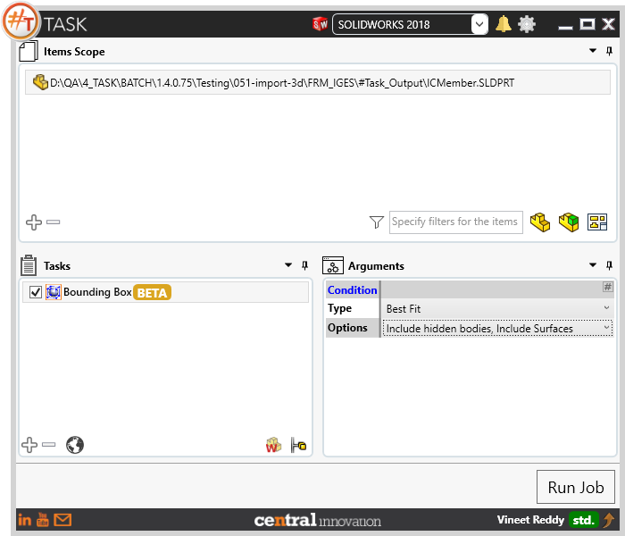
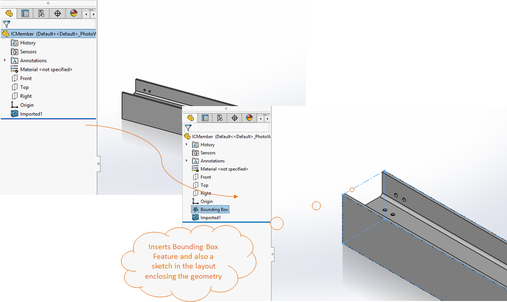
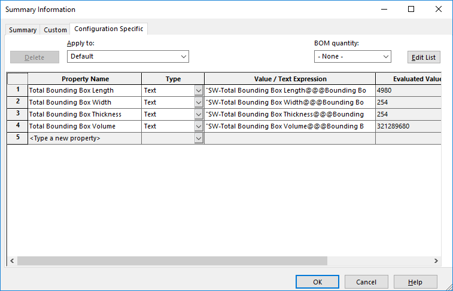
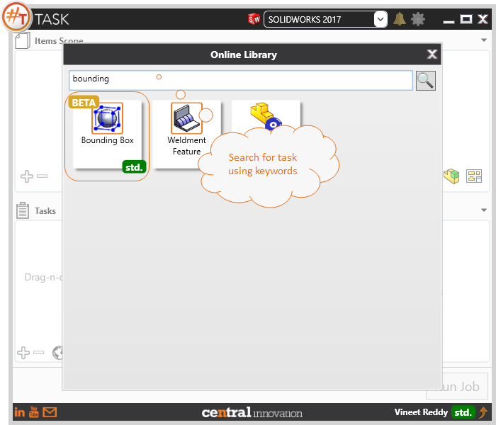

## Task Description

The task allows to insert a bounding box for a standard part. Represents the smallest area or volume in which a design can fit. Creating a bounding box for a part also generates a number of file properties automatically, which can be linked to drawings. Task uses native SolidWorks functionality from reference geometry.  Task works with part documents [*.SLDPRT]

A comparative view of a drawing processed using Bounding Box task is shown below.

Additionally, a set of Configuration Specific Custom Properties will be automatically created and values calculated for each of them.

## File Types

| Supported | Description |
| --- | --- |
| SLDPRT | Supports SolidWorks Part Files only |

## Download & Task Setup

User can download this task from online library performing search using keywords.

Select the task in Tasks list and setup arguments as required.

| Argument | Details |
| --- | --- |
| Type                    | User can choose between best fit and custom plane |
| *Best Fit*              | When selected, task automatically calculates the best possible fit and creates the feature |
| *Custom Plane*          | When selected, the largest place present on the model will be selected as the first two dimensions and the last one as the height |
| Options | User can choose one or more options using the multi select dropdown list |
| *Include Hidden Bodies* | When checked, Bounding Box will include Visible as well as Hidden bodies |
| *Include Surfaces*      | When checked, Bounding Box will include Surfaces             |

## Download Sample Files

Sample files can be downloaded from 
[Sample Model in Solidworks 2017](../000-model/SolidWorks_2017_RoboticArm.zip)

[Click to view the model at GrabCad](https://grabcad.com/library/5-dof-robot-1)
