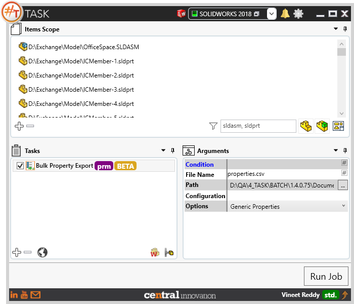
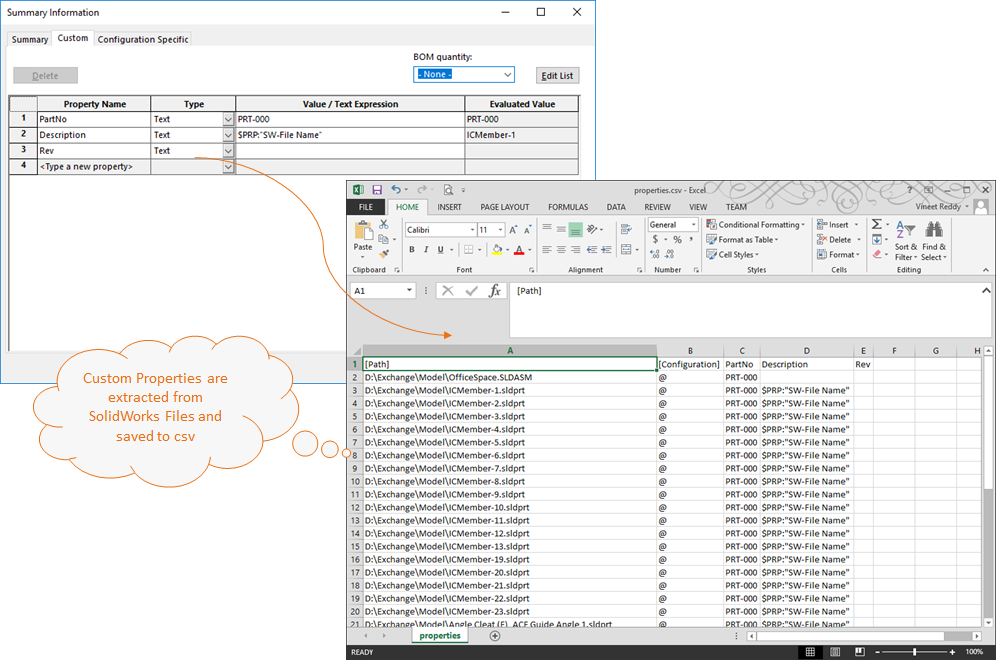
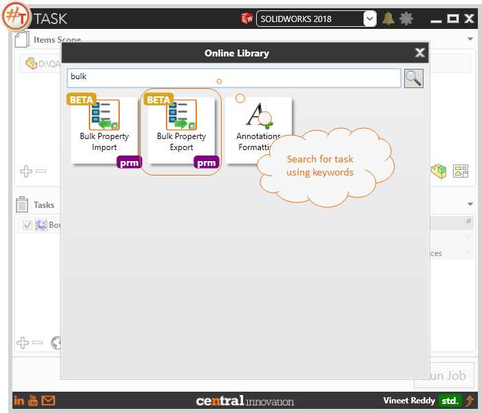

## Task Description

This task can be used to manage metadata present in the form of custom properties.
 - Export all Properties from Solidworks files into one excel file.
 - User can modify the data contented in excel file and import it back
 - Options to choose to Export Generic or Configuration Specific properties.
 - Properties specific to a particular configuration can be exported by specifying its Configuration Name
 - User can choose a File Name by specifying text or using placeholders
 - User can choose a Path to export the excel file
This task works best with `Bulk Property Import` task.

A comparative view of a drawing processed using Activate Sheet task is shown below.

Sample output file can be downloaded from here. [[Properties.csv](properties.csv)]

## File Types

| Supported | Description |
| --- | --- |
| SLDDRW | Supports SolidWorks Drawing Files only |

## Download & Task Setup

User can download this task from online library performing search using keywords.

Select the task in Tasks list and setup arguments as required.

| Argument      | Details                                                      |
| ------------- | ------------------------------------------------------------ |
| File Name     | Enter a name for the output file. User can choose to save as an xlsx or csv file. File extension is mandatory |
| Path          | Enter a path to the folder where the output file has to be saved |
| Configuration | If properties from a specific configuration has to be saved, then the configuration name should be specified. If all configurations are to be processed, leave this field empty |
| Options       | Specify to output Generic Properties and / or Configuration Specific Properties |

## Demo Video

<video width="720" height="480" controls>
  <source src="http://cloud.ic3d.com.au.s3.amazonaws.com/sharp_task/library/mdl_export_import_custom_prop/res/BULK_PROPERTY.mp4" type="video/mp4">
</video>

## Download Sample Files

Sample files can be downloaded from 
[Sample Model in Solidworks 2017](../000-model/SolidWorks_2017_RoboticArm.zip)

[Click to view the model at GrabCad](https://grabcad.com/library/5-dof-robot-1)
