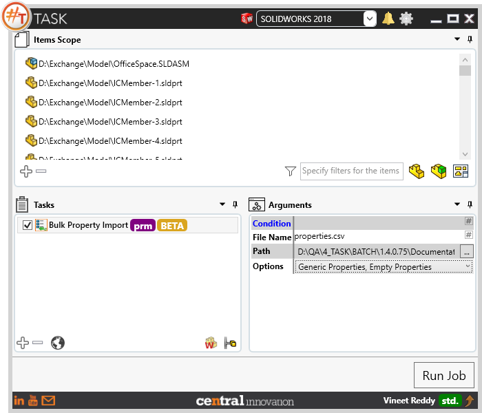
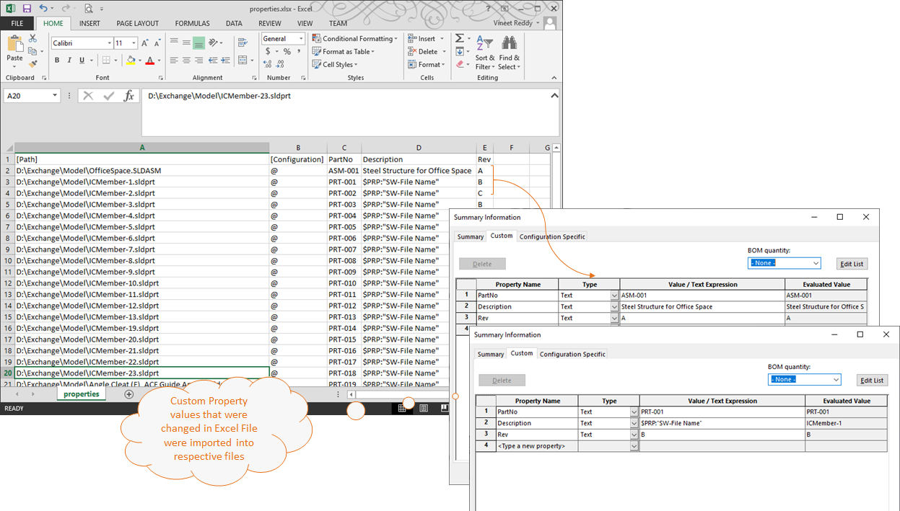
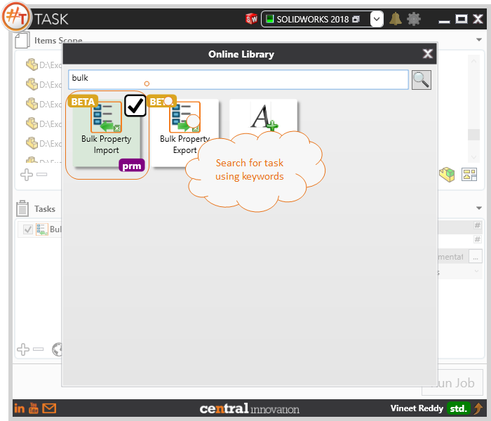

## Task Description

This task can be used to import metadata present in an excel file against Custom and Configuration specific properties.
 - Import Properties from excel into Solidworks files referenced by its path and configuration name
 - User can choose the file name from which the properties are to be imported.
 - User can specify the file path where the file is located. 
 - Options to choose to Import Generic or Configuration Specific properties or Empty Properties
 If user does not choose to import empty properties, then properties without values against the specific Solidworks file will not be imported
This task works best with 'Bulk Property Export' task.

A comparative view of a drawing processed using Activate Sheet task is shown below.

Sample output file can be downloaded from here. [[Properties.xlsx](properties.xlsx)]
## File Types

| Supported | Description |
| --- | --- |
| SLDPRT | Supports SolidWorks Part Files |
| SLDASM | Supports SolidWorks Assembly Files |
| SLDDRW | Supports SolidWorks Drawing Files |

## Download & Task Setup

User can download this task from online library performing search using keywords.

Select the task in Tasks list and setup arguments as required.

| Argument      | Details                                                      |
| ------------- | ------------------------------------------------------------ |
| File Name     | Enter a name for the output file. User can choose to save as an xlsx or csv file. File extension is mandatory |
| Path          | Enter a path to the folder where the output file has to be saved |
| Options       | Specify to output `Generic Properties`, `Configuration Specific Properties`, `Empty Properties`. By default this task ignores adding custom properties if its value is empty. To change this behavior, it is mandatory to select `Empty Properties` from drop down|

## Demo Video

<video width="720" height="480" controls>
  <source src="http://cloud.ic3d.com.au.s3.amazonaws.com/sharp_task/library/mdl_export_import_custom_prop/res/BULK_PROPERTY.mp4" type="video/mp4">
</video>

## Download Sample Files

Sample files can be downloaded from 
[Sample Model in Solidworks 2017](../000-model/SolidWorks_2017_RoboticArm.zip)

[Click to view the model at GrabCad](https://grabcad.com/library/5-dof-robot-1)
