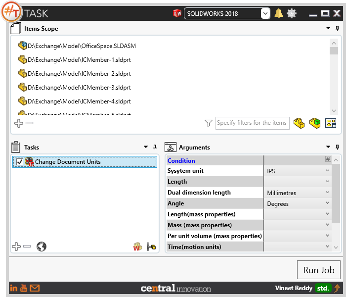
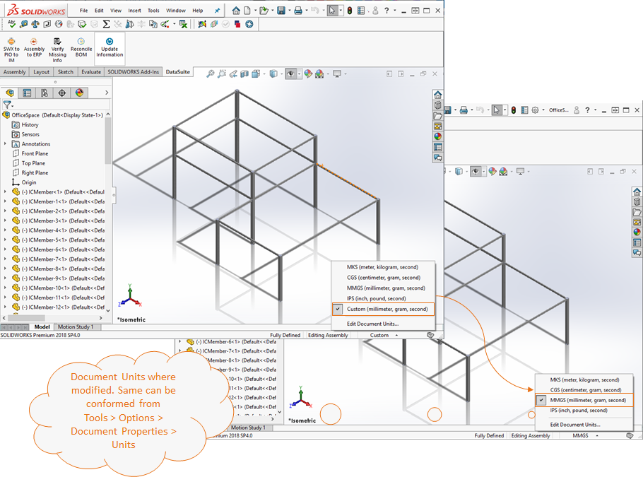
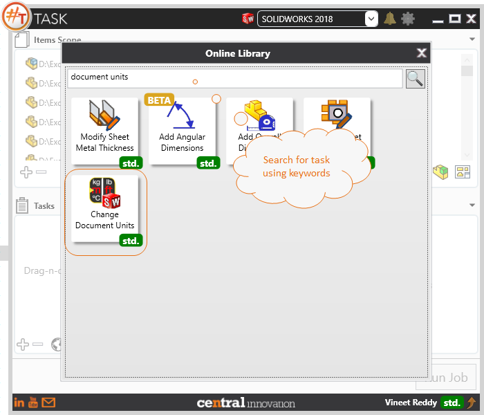

## Task Description

The task helps in Setting / changing the Document Units for the selected Solidworks Files. 
 - User can Set the units to 'MKS', 'CGS', 'MMGS', 'IPS' or 'Custom'.
 - When setting to predefined units, user can enter values against System Unit, Length and Dual Dimension Length. 
 - If a value is not set then the same will not be modified. However, when 'Custom' units is selected, user has the provision to specify the values against all fields.
 - This task works with all Solidworks native files. [*.SLDDRW, *.SLDPRT, *.SLDASM]

A comparative view of an assembly file processed using `Change Document Units` task is shown below.

## File Types

| Supported | Description |
| --- | --- |
| SLDPRT | Supports SolidWorks Part Files |
| SLDASM | Supports SolidWorks Assembly Files |
| SLDDRW | Supports SolidWorks Drawing Files |

## Download & Task Setup

User can download this task from online library performing search using keywords.

Select the task in Tasks list and setup arguments as required.

| Argument | Details |
| :--- | :--- |
| System Unit| Select from a Drop-Down list of System Units configured in Solidworks by default solidworks has following system of units `CGS, MKS, IPS, MMKS, Custom` |
| Length | Required only if System Unit is set to `Custom`. Specify a unit from Drop Down list. Available values are `Millimeters, Centimeters, metres, Inches, Feet, Feet&Inches, Angstroms, Nanometers, Microns, Mils, Microinches` |
| Dual Dimension Length | If Dual Dimensions are needed, user can choose the units from a list. Available values are `Millimeters, Centimeters, metres, Inches, Feet, Feet&Inches, Angstroms, Nanometers, Microns, Mils, Microinches` |
| Angle | Specify the units for Angular dimensions. Available values are `Degrees, Radians, Degress per minite, Degress per minite per second` |
| Length (Mass Properties) | Required only if System Unit is set to `Custom`. Specify units for Length to be used in Mass Properties calculation. Available values are `Millimeters, Centimeters, metres, Inches, Feet, Feet&Inches, Angstroms, Nanometers, Microns, Mils, Microinches` |
| Mass (Mass Properties) | Required only if System Unit is set to `Custom`. Specify units for Mass to be used in Mass Properties calculation. Available values are `Milligrams, Grams, Kilograms,Pounds` |
| Per Unit Volume (Mass Properties) | Required only if System Unit is set to `Custom`. Available units are `angstroms`3, `nanometer`3, `Microns`3, `Millimeter`3, `Centimeter`3, `Metres`3, `MicroInches`3, `Mils`3, `Inch`3, `Feet`3, `Microlitres`, `Millilitres`, `Centilitres`, `Decilitres`, `litres`, `Hectolitres`, `US FluidOunce, US Pints, US Gallons, IMP Gallons, IMP Cubicyards`|
| Time (Motion Units) | Required only if System Unit is set to `Custom`. Available units are `NanoSecond, MicroSecond, MilliSecond, Second, Minute, Hour`|
| Force (Motion Units) | Required only if System Unit is set to `Custom`. Available units are `MilliNewtons, Newtons, KiloNewtons, megaNetwons, PoundFeet, OunceForce` |
| Power (Motion Units) | Required only if System Unit is set to `Custom`. Available units are `Watt, KiloWatt, Horsepower` |
| Energy (Motion Units) | Required only if System Unit is set to `Custom`. Available units are `Joules, Ergs, BTU, KiloWattHour` |

## Demo Video

Below is a video of demonstrating activate sheet task in usage

<video width="720" height="480" controls>
  <source src="002_ActivateSheet.swf" type="video/mp4">
</video>

## Download Sample Files

Sample files can be downloaded from 
[Sample Model in Solidworks 2017](../000-model/SolidWorks_2017_RoboticArm.zip)

[Click to view the model at GrabCad](https://grabcad.com/library/5-dof-robot-1)
