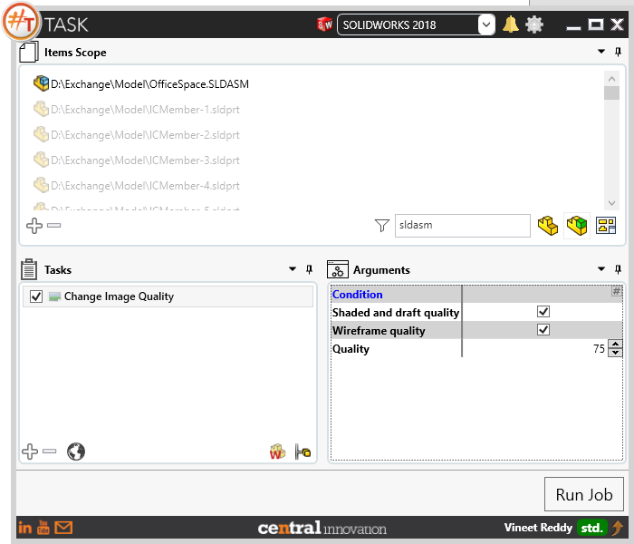
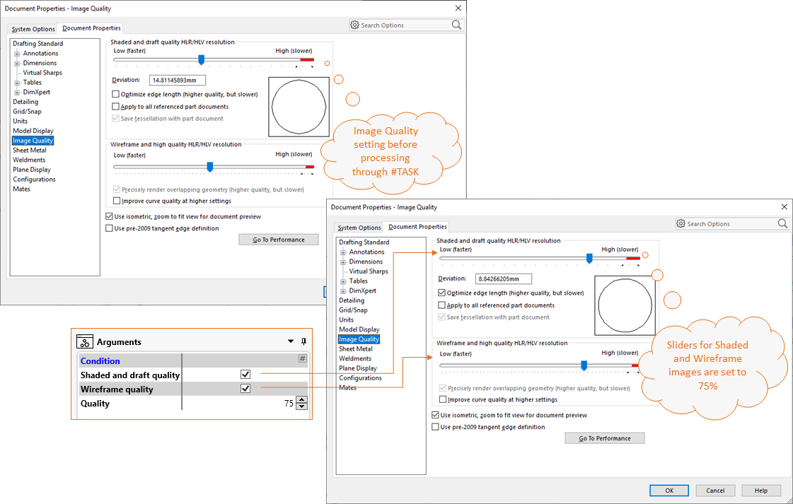
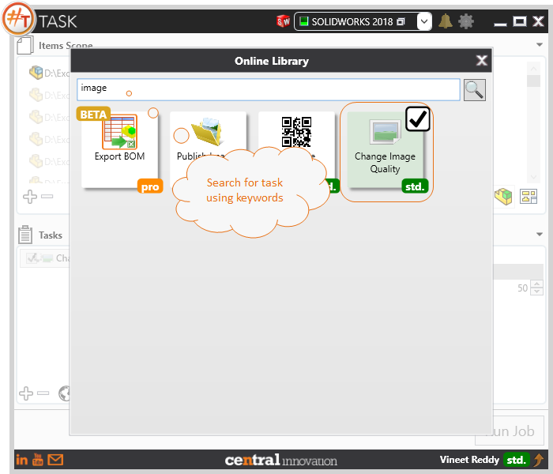

## Task Description

This task can be used to change image quality of Solidworks part, assembly or drawing files. 
 - Modifies the setting available at Tools > Options > Document Properties > Image Quality
 - It modifies the setting for Shaded and Draft Quality HLR/HLV by setting the percentage.
 - Wireframe and High quality images can be set using HLR/HLV resolution
 - User can set the quality level using the Quality field specifying the percentage level

A comparative view of an assembly processed through "Change Image Quality" task is shown below.

## File Types

| Supported | Description |
| --- | --- |
| SLDPRT | Supports SolidWorks Part Files |
| SLDASM | Supports SolidWorks Assembly Files |
| SLDDRW | Supports SolidWorks Drawing Files |

## Download & Task Setup

User can download this task from online library performing search using keywords.

Select the task in Tasks list and setup arguments as required.

| Argument | Details |
| --- | --- |
| Shaded and Draft Quality| When Enabled, the Quality setting slider for Shaded and Draft Quality is modified |
| Wireframe Quality | When Enabled, the Quality setting slider for Wireframe and High Quality is modified |
| Quality | A value between `1` for `Low Quality` And `100` for `High Quality`. User can either type a value by typing in or by using the control. |

## Demo Video

Below is a video of demonstrating activate sheet task in usage

<video width="720" height="480" controls>
  <source src="002_ActivateSheet.swf" type="video/mp4">
</video>

## Download Sample Files

Sample files can be downloaded from 
[Sample Model in Solidworks 2017](../000-model/SolidWorks_2017_RoboticArm.zip)

[Click to view the model at GrabCad](https://grabcad.com/library/5-dof-robot-1)
