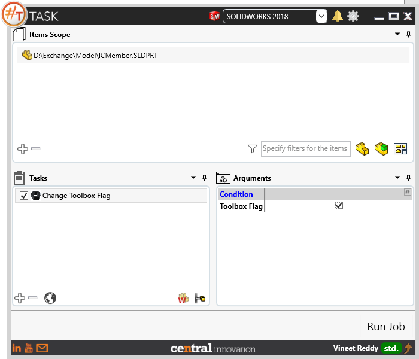

## Task Description

Task allow to change the toolbox flag for components.
 - User can choose to enable Toolbox Flag which means that the component will be set to Read-Only and cannot be modified.
 - User can choose to disable Toolbox Flag which means that the component will be set to have Write Access and can be modified.
 - Task works with Solidworks Parts only and is compatible with Solidworks 2014 or newer versions.

A comparative view of a part processed using `Change Toolbox Flag` task is shown below.

## File Types

| Supported | Description |
| --- | --- |
| SLDPRT | Supports SolidWorks Part Files |
| SLDASM | Supports SolidWorks Assembly Files |

## Download & Task Setup

User can download this task from online library performing search using keywords.

Select the task in Tasks list and setup arguments as required.

| Argument | Details |
| --- | --- |
| Toolbox Flag| When checked, It sets Toolbox flag as `True` for Solidworks Parts / Assemlies processed through #TASK and vice versa |

## Demo Video

<video width="720" height="480" controls>
  <source src="002_ActivateSheet.swf" type="video/mp4">
</video>

## Download Sample Files

Sample files can be downloaded from 
[Sample Model in Solidworks 2017](../000-model/SolidWorks_2017_RoboticArm.zip)

[Click to view the model at GrabCad](https://grabcad.com/library/5-dof-robot-1)
