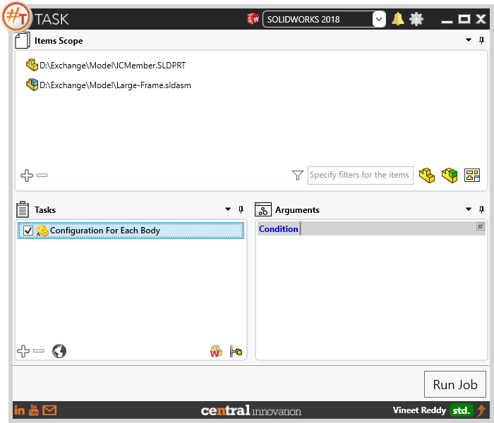
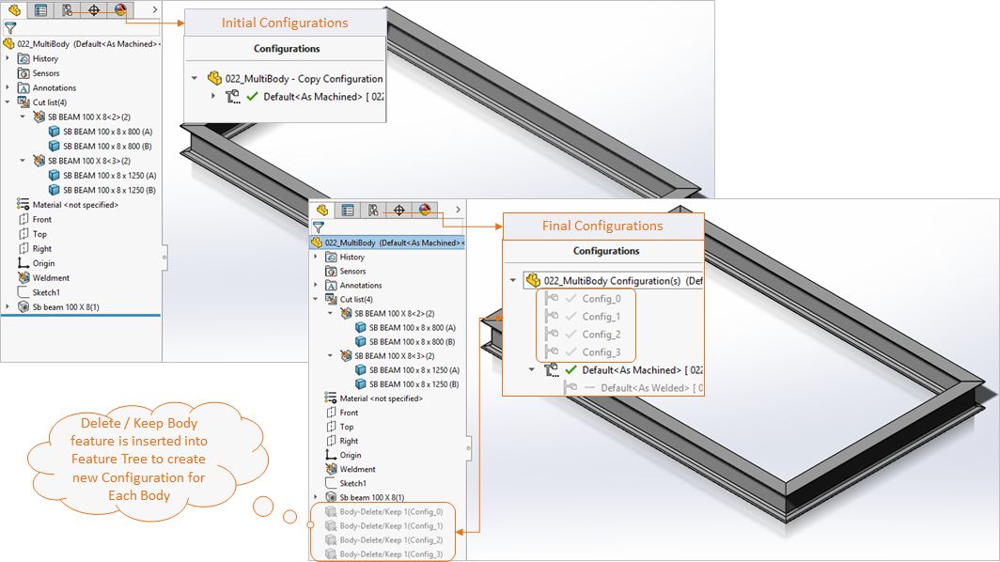
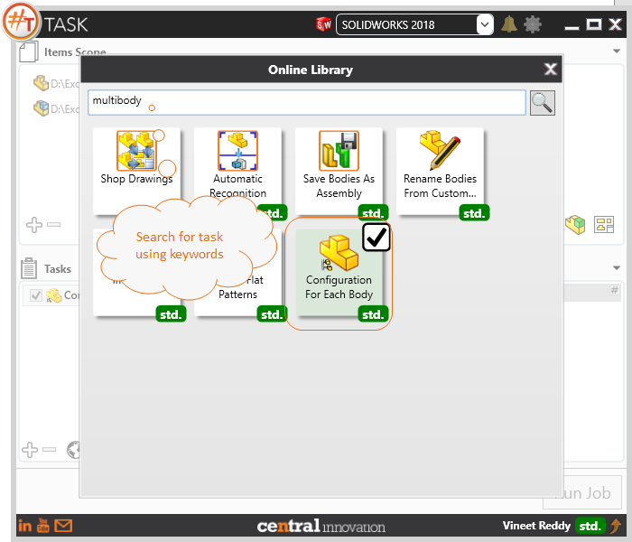

## Task Description

Task can be used to create Configurations for each body within  a multibody. 
 - Can be used to generate custom properties specific to the geometry of the body.
 - User can insert properties like ""Mass"", ""Volume"", ""Surface Area"", etc. to calculate automatically
 - Task uses Delete/Keep body feature to enable a specific body for selected configuration.
 - Task works only with Solidworks Parts. [*.SLDPRT]

A comparative view of a Multibody Part processed using `Configuration for Each Body` task is shown below.

## File Types

| Supported | Description |
| --- | --- |
| SLDPRT | Supports SolidWorks Part files only |

## Download & Task Setup

User can download this task from online library performing search using keywords.

This task does not contain any argument.

## Demo Video

<video width="720" height="480" controls>
  <source src="002_ActivateSheet.swf" type="video/mp4">
</video>

## Download Sample Files

Sample files can be downloaded from 
[Sample Model in Solidworks 2017](../000-model/SolidWorks_2017_RoboticArm.zip)

[Click to view the model at GrabCad](https://grabcad.com/library/5-dof-robot-1)
