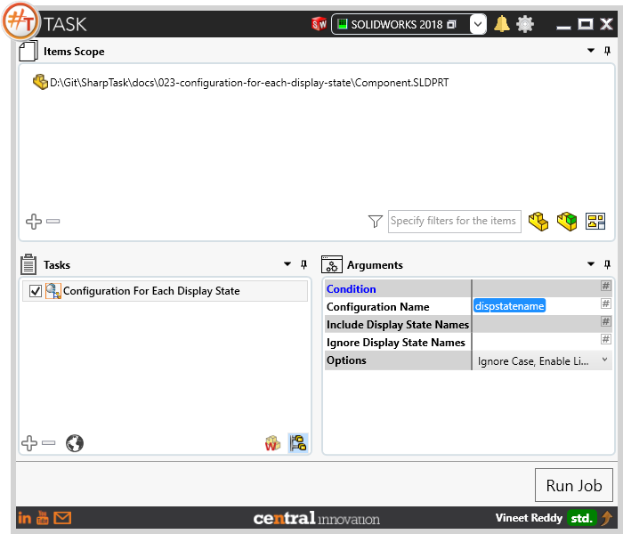
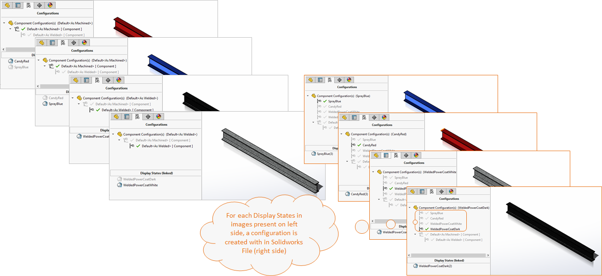
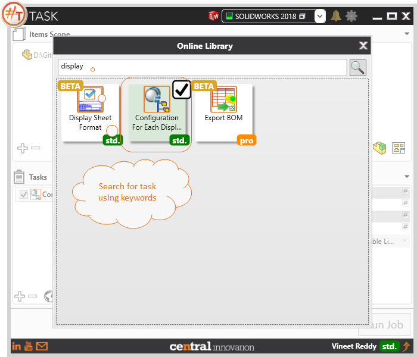

## Task Description

This task allows to add a configuration for each display state of the model.  Task works with *.SLDPRT and *.SLDASM Files.

A comparative view of a drawing processed using Activate Sheet task is shown below.

## File Types

| Supported | Description |
| --- | --- |
| SLDPRT | Supports SolidWorks Part files|
| SLDASM | Supports SolidWorks Assembly files|

## Download & Task Setup

User can download this task from online library performing search using keywords.

Select the task in Tasks list and setup arguments as required.

| Argument | Details |
| --- | --- |
| Configuration Name | Specify the Configuration Name using Text Input or Select from a list of Placeholders |
| Include Display State Names | Specify comma separated list of Display State Names for which Configuration needs to be created. Configuration will only be created for the values specified in this list |
| Ignore Display State Names | Specify comma separated list of Display State Names for which Configuration needs to be ignored. Configuration will only be created for the values specified in this list |
| Options | User can choose single or Multi select pick list |
| Ignore Case | When matching display state names from `Include Display State Names` and `Ignore Display State Names` lists, Character case will be ignored |
| Match Whole Phrase | When matching display state names from `Include Display State Names` and `Ignore Display State Names` lists, whole phrase will be matched |
| Enable link Display States to Configuration | When enabled, Display State will be linked to respective configuration. |

## Demo Video

<video width="720" height="480" controls>
  <source src="002_ActivateSheet.swf" type="video/mp4">
</video>

## Download Sample Files

Sample files can be downloaded from 
[Sample Model in Solidworks 2018](Component.sldprt)

[Click to view the model at GrabCad](https://grabcad.com/library/5-dof-robot-1)
