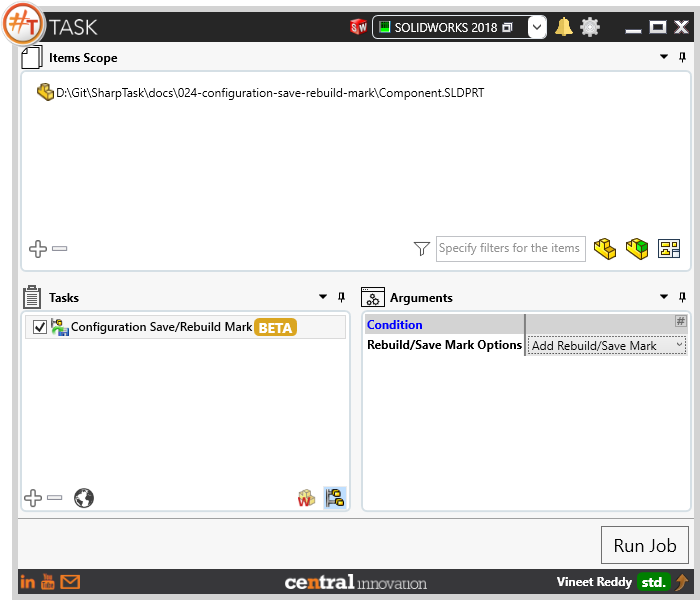
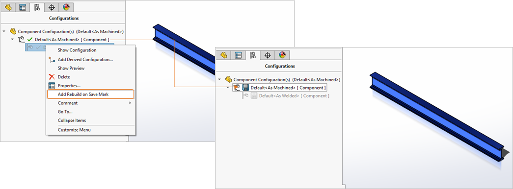
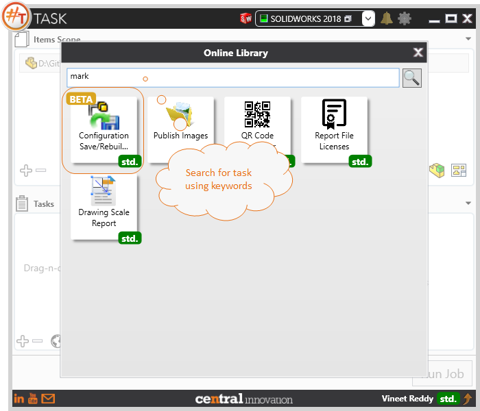
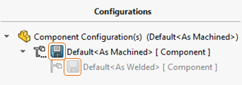

## Task Description

Adds/Removes Save/Rebuild Mark for active configuration. Removing Save/Rebuild Mark allows to increase the performance.  Task works with part and assembly documents `*.SLDPRT, *.SLDASM`

A comparative view of a drawing processed using Activate Sheet task is shown below.

## File Types

| Supported | Description |
| --- | --- |
| SLDPRT | Supports SolidWorks Part Files |
| SLDASM | Supports SolidWorks Assembly Files |

## Download & Task Setup

User can download this task from online library performing search using keywords.

Select the task in Tasks list and setup arguments as required.

| Argument | Details |
| --- | --- |
| Rebuild / Save Mark Options | User can select to either Add or Remove the mark from target Solidworks Part or Assembly file. |
| Add Rebuild / Save Mark | When Selected to Add this mark, file processed through #TASK using this option will have a `Diskette Icon` against the target configuration.  |
| Remove Rebuild / Save Mark | When selected to Remove this mark, file processed through #TASK using this option will have a `Green Tick` against the target configuration. |

## Demo Video

<video width="720" height="480" controls>
  <source src="002_ActivateSheet.swf" type="video/mp4">
</video>

## Download Sample Files

Sample files can be downloaded from 
[Sample Model in Solidworks 2017](Component.sldprt)