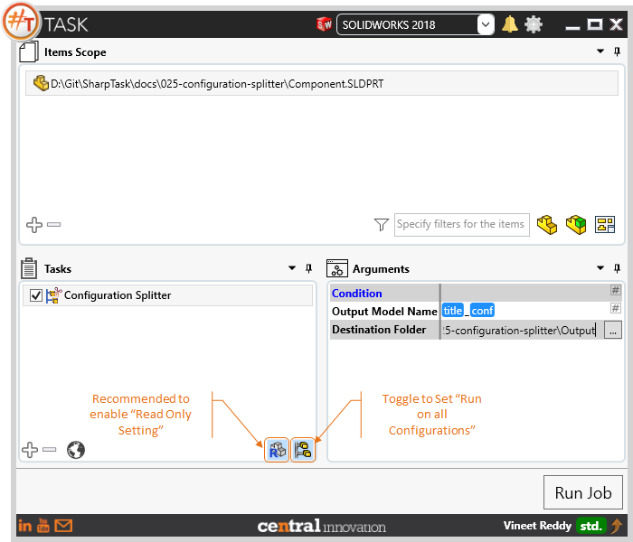
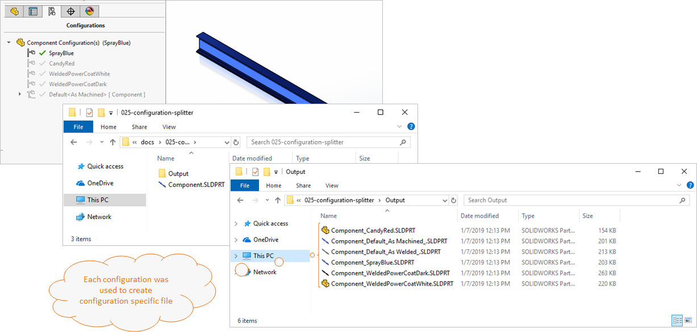
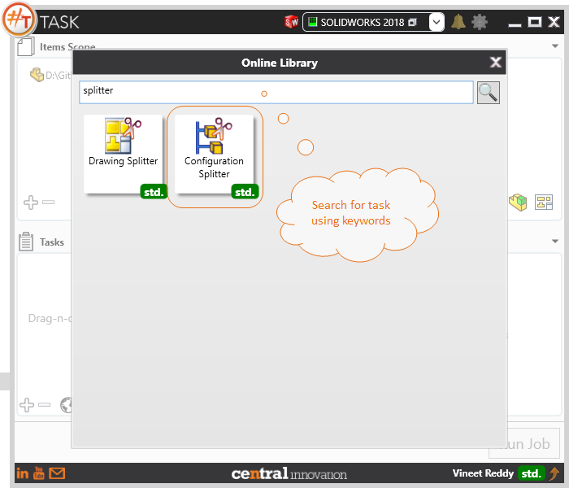

## Task Description

This task helps user to process Part or Assembly files containing configurations to save each configuration as an individual Solidworks File.
 - To generate from active configuration only, please choose `Run on Active Configuration Only`
 - To process all configuration, Please choose `Run on each configuration`
 - Saves the output in same format as the input files.
 - User can specify a Output File Name by either typing in the name as text or by using placeholders
 - Input file is not modified, however it is recommended to use `Open Read Only` setting in #TASK

A comparative view of a drawing processed using Activate Sheet task is shown below.

## File Types

| Supported | Description |
| --- | --- |
| SLDPRT | Supports SolidWorks Part Files |
| SLDASM | Supports SolidWorks Assembly Files |

## Download & Task Setup

User can download this task from online library performing search using keywords.

Select the task in Tasks list and setup arguments as required.

| Argument | Details |
| --- | --- |
| Output Model Name | Enter a name for Model files created using Text or choose from a list of Placeholders |
| Destination Folder | Specify path to Output Folder |

## Demo Video

<video width="720" height="480" controls>
  <source src="002_ActivateSheet.swf" type="video/mp4">
</video>

## Download Sample Files

Sample files can be downloaded from 
[Sample Model in Solidworks 2018](Component.sldprt)

