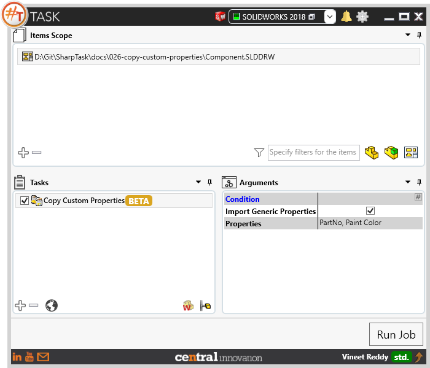
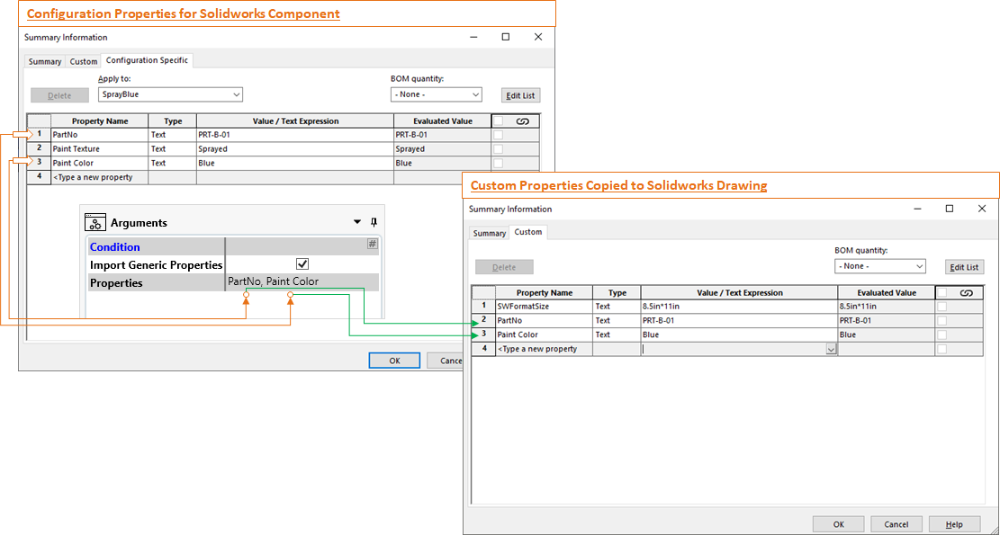
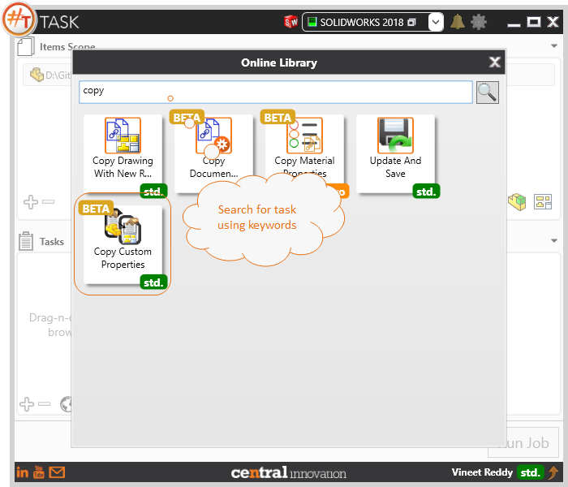

## Task Description

This task can be used when Configuration specific properties existing in a Part / Assembly have to be copied to their respective drawings. User can process Solidworks  Drawings which have a Drawing View referencing a Solidworks Part / Assembly. 
 - Configurations specific properties from part are copied to drawing custom properties. [considers only the first drawing view picked by `Drawing View #`]
 - User can choose specific properties to be copied along with its values.
 - The properties will be copied to the Drawing Custom Properties tab.
 - User can choose to process a complete folder or files

A comparative view of a drawing processed using Activate Sheet task is shown below.

## File Types

| Supported | Description |
| --- | --- |
| SLDDRW | Supports SolidWorks Drawing Files only |

## Download & Task Setup

User can download this task from online library performing search using keywords.

Select the task in Tasks list and setup arguments as required.

| Argument | Details |
| --- | --- |
| Import Generic Properties | When selected, Task looks for Custom Properties against the configuration, If not found it looks into the Custom Properties |
| Properties | List of Properties that need to be copied from Solidworks Part into Solidworks Drawing are specified as comma separated values. This field can be left empty when all properties are to be copied. |

## Demo Video

<video width="720" height="480" controls>
  <source src="002_ActivateSheet.swf" type="video/mp4">
</video>

## Download Sample Files

Sample files can be downloaded from 
[Sample Model in Solidworks 2017](026-component.zip)