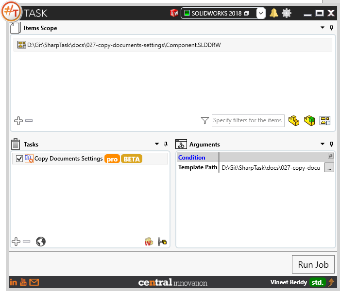
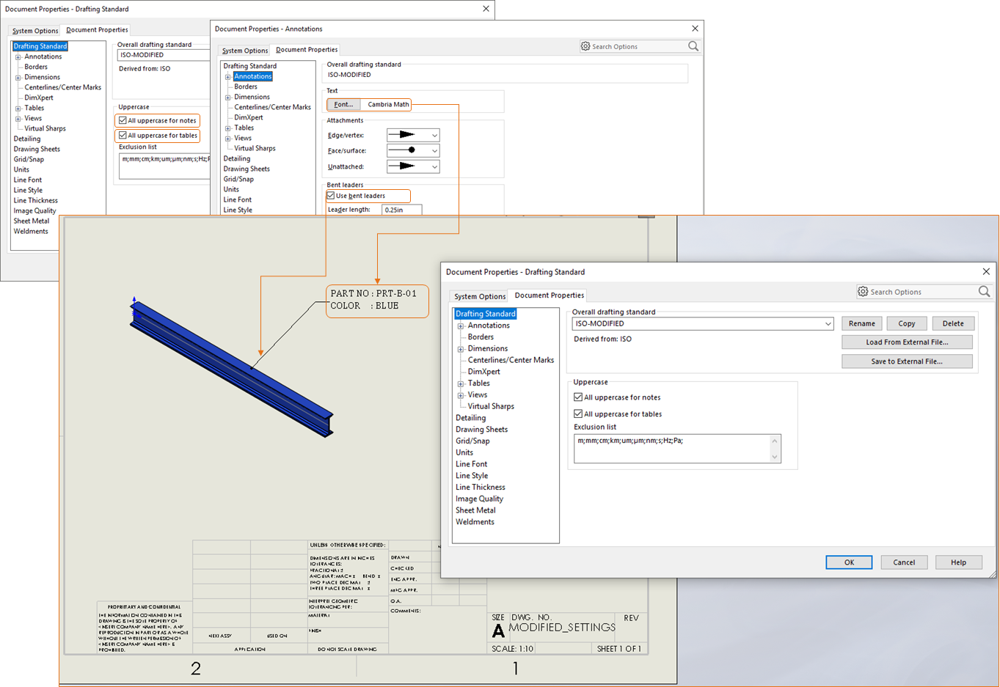
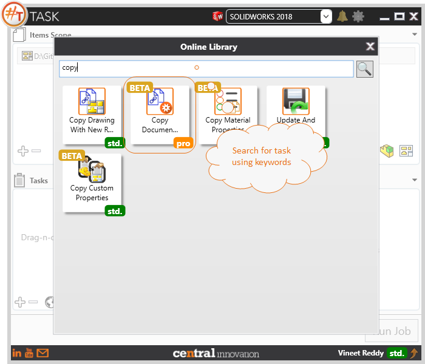

## Task Description

The task is useful when user wants to copy the settings presented in Tools > Options > Document Properties from a Source to Target Files
 - User can select Solidworks Part, Assembly or Drawing file as the Source
 - Settings will be applied to all Items present in Items Scope base on filter

A comparative view of a drawing processed using `Copy Document Settings`  is shown below.

## File Types

| Supported | Description |
| --- | --- |
| SLDDRW | Supports SolidWorks Drawing Files |
| SLDPRT | Supports SolidWorks Part Files |
| SLDASM | Supports SolidWorks Assembly Files |

## Download & Task Setup

User can download this task from online library performing search using keywords.

Select the task in Tasks list and setup arguments as required.

| Argument | Details |
| --- | --- |
| Template Path | Full File path to Solidworks Part, Assembly or Drawing using which Document Settings will be copied from. |

## Demo Vide

Below is a video of demonstrating activate sheet task in usage

<video width="720" height="480" controls>
  <source src="002_ActivateSheet.swf" type="video/mp4">
</video>

## Download Sample Files

Sample files can be downloaded from 
[Sample Model in Solidworks 2017](027-settings.zip)