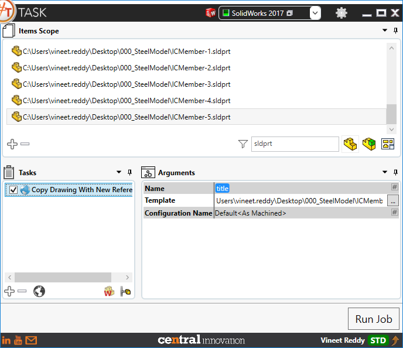
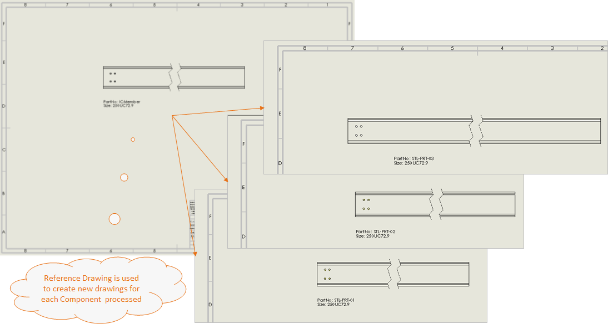

## Task Description

This task allows user to create a new drawing file per Item present in the Items Scope
 - User has the Option to create drawings for each Item in Items Scope by specifying a drawing template using a Solidworks Drawings file
 - Drawing created using Solidworks Part will generate drawings using Solidworks Part file [*.SLDPRT]
 - Drawing created using Solidworks Assembly will generate drawings using Solidworks Assembly file [*.SLDASM]
 - Task works with Solidworks Drawing files only [*.SLDDRW]

A comparative view of a drawing processed using Activate Sheet task is shown below.

## File Types

| Supported | Description |
| --- | --- |
| SLDDRW | Supports SolidWorks Drawing Files only |

## Download & Task Setup

User can download this task from online library performing search using keywords.
Select the task in Tasks list and setup arguments as required.

| Argument | Details |
| --- | --- |
| Name | Enter a name for Output file. User can choose a placeholder by clicking on `#` to access placeholder menu |
| Template           | Full path to SolidWorks Drawing file that will be considered as Template for SolidWorks Model file |
| Configuration Name | User can choose a specific configuration Name by specifying in this field. |

## Demo Video

<video width="720" height="480" controls>
  <source src="http://cloud.ic3d.com.au.s3.amazonaws.com/sharp_task/library/mdl_copy_and_replace_reference/res/COPY_DRAWING_TO_REFERENCES.mp4" type="video/mp4">
</video>

## Download Sample Files

Sample files can be downloaded from 
[Sample Model in Solidworks 2017](028_SteelModel.zip)