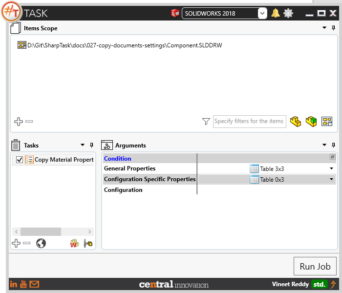
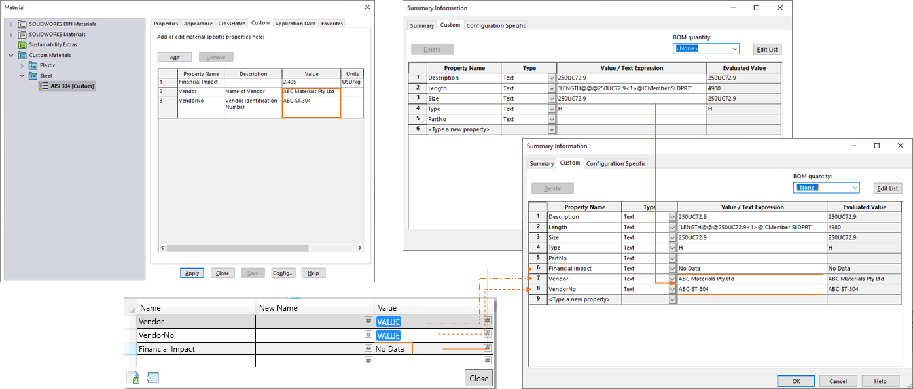
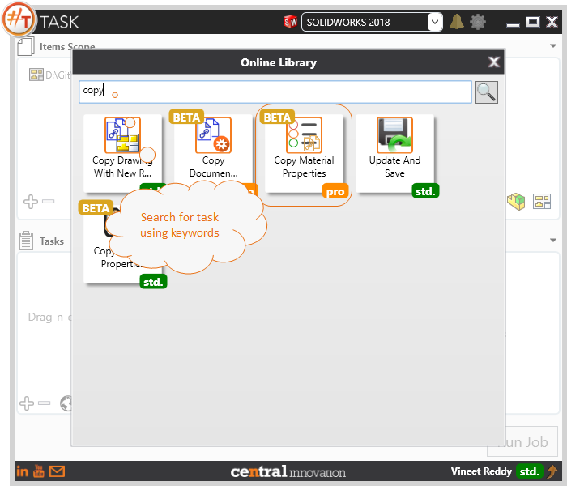
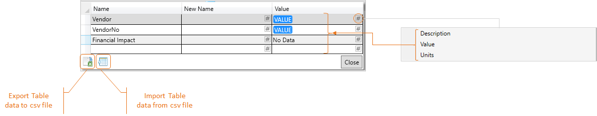

## Task Description

The task can copy material specific properties from materials library into the document properties.
 - User can enable "Run macro on each configuration" if all configurations are to be processed
 - Option to choose to process General or Configuration Specific Properties. Can filter Configuration based on Name.
 - Task works with Solidworks Parts only.
 - To copy custom properties from material to document, 
 - For all Properties Choose "*" in Name and Placeholder "VALUE"
 - The task assumes that material database name is unique. [i.e. Database name in material library should not repeat]

A comparative view of a drawing processed using Activate Sheet task is shown below.

## File Types

| Supported | Description |
| --- | --- |
| SLDPRT | Supports SolidWorks Part Files only |

## Download & Task Setup

User can download this task from online library performing search using keywords.

Select the task in Tasks list and setup arguments as required.

| Argument | Details |
| --- | --- |
| General Properties | Data Enter in Table control will be added / modified in Custom Tab |
| Configuration Specific Properties | Data Enter in Table control will be added / modified in Custom Tab |
| Configuration | User can Specify Configuration Names to be affected. Can contain Comma separated list of values |

### Properties Table Control

| Options         | Details                                                      |
| --------------- | ------------------------------------------------------------ |
| Name            | User can enter a name manually. This should match the Custom Property name listed against the material in Material Library |
| New Name        | User can specify a new name for the selected property as text or resolve it dynamically using `placeholders`. |
| Value           | User can enter a Text value to be assigned against the Custom Property Name or choose from Placeholders. When trying to copy values from material custom properties, user can choose to assign `Description` / `Value` / `Units` as value against the matched custom property |
| Export to CSV   | Click to Export Table data into csv file. [Sample CSV Export File](Export_Table_data.csv) |
| Import from CSV | Click to Import Table data into csv file.                    |

## Demo Video

<video width="720" height="480" controls>
  <source src="http://cloud.ic3d.com.au.s3.amazonaws.com/sharp_task/library/prt_copy_material_prps/res/PRO_COPY_MAT_PROP.mp4" type="video/mp4">
</video>

## Download Sample Files

Sample files can be downloaded from 
[Sample Model in Solidworks 2018](ICMember.sldprt)