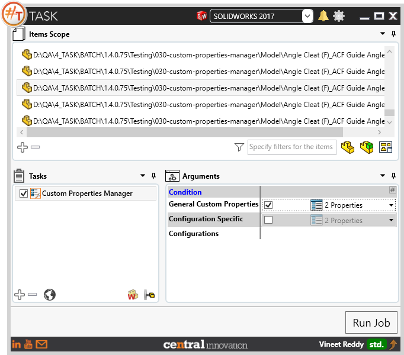
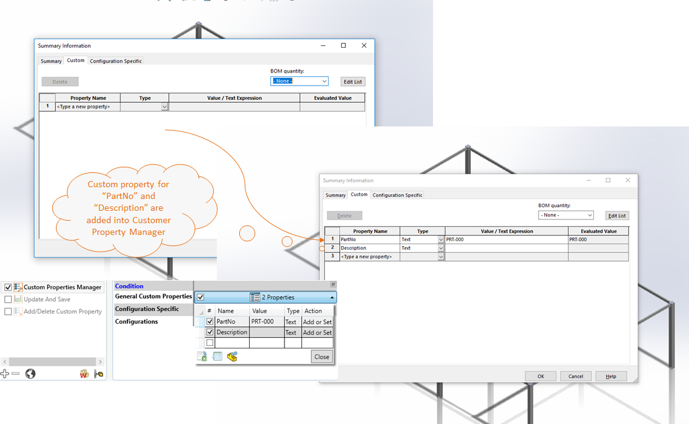
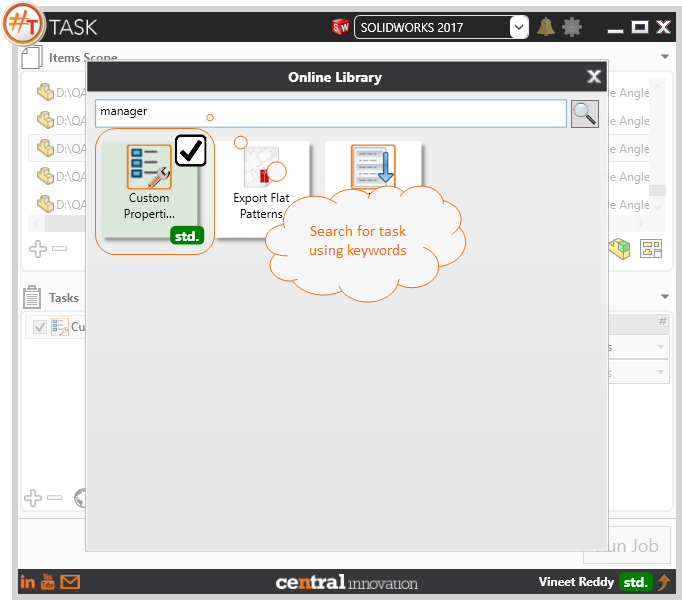
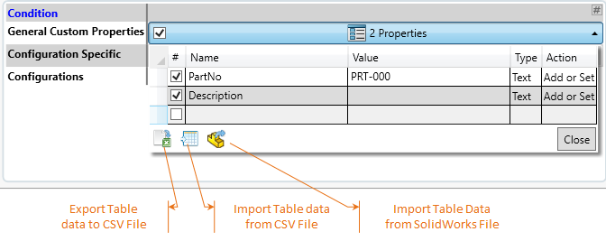

## Task Description

The task supports Adding / Removing / Renaming Custom and Configuration specific properties. 
 - If the property with same name is present, then it will be replaced
 - Task uses a Table control which allows easy data entry
 - User can type in the values, Load from a CSV file or Select a Solidworks Native file to load from
 - Provision to export the values to CSV file is available to the user
 - User can choose to process Custom Properties or Configuration Specific Properties
 - User can choose to Process Active Configurations, or Specific Configurations.

A comparative view of a drawing processed using Activate Sheet task is shown below.

## File Types

| Supported | Description |
| --- | --- |
| SLDASM | Supports SolidWorks Assembly Files |
| SLDPRT | Supports SolidWorks Part Files |
| SLDDRW | Supports SolidWorks Drawing Files |

## Download & Task Setup

User can download this task from online library performing search using keywords.

Select the task in Tasks list and setup arguments as required.

| Argument | Details |
| --- | --- |
| General Custom Properties | Define Key-Value pair for Custom Properties that are to be inserted in Custom Tab |
| Configuration Specific | Define Key-Value pair for Custom Properties that are to be inserted in Configuration Tab |
| Configurations | Specific Configuration name where Custom Properties are to be inserted. User should add Key-Value pairs in Configuration Specific argument |

### Properties Table Control

| Options                      | Details                                                      |
| ---------------------------- | ------------------------------------------------------------ |
| Name                         | User can enter a name manually or select from a predefined list. User can modify the predefined list of values by accessing the file at *"%appdata%\#TASK\SharpSwTask\properties.txt"* |
| Value                        | User can enter a Text value to be assigned against the Custom Property Name specified in the left column |
| Type                         | Choose from `Text, Date, Yes/No, Number`                     |
| Action                       | Specify the required action. Default is "Add or Set"         |
| Add or Set                   | Choose when Custom Property is to be Newly Added             |
| Rename                       | Choose when Custom Property is to be renamed                 |
| Remove                       | Choose when Custom Property is to be deleted                 |
| Export to CSV                | Click to Export Table data into csv file                     |
| Import from CSV              | Click to Import Table data into csv file                     |
| Import from Solidworks Files | User can choose to fill the Table with data imported from SolidWorks Custom Properties Manager by choosing Solidworks Part, Assembly or Drawing file containing Properties |

## Demo Video

<video width="720" height="480" controls>
  <source src="http://cloud.ic3d.com.au.s3.amazonaws.com/sharp_task/videos/Sharptask_custo_prop_mgr.mp4" type="video/mp4">
</video>

## Download Sample Files

Sample files can be downloaded from 
[Sample Model in Solidworks 2017](../000-model/SolidWorks_2017_RoboticArm.zip)

[Click to view the model at GrabCad](https://grabcad.com/library/5-dof-robot-1)
