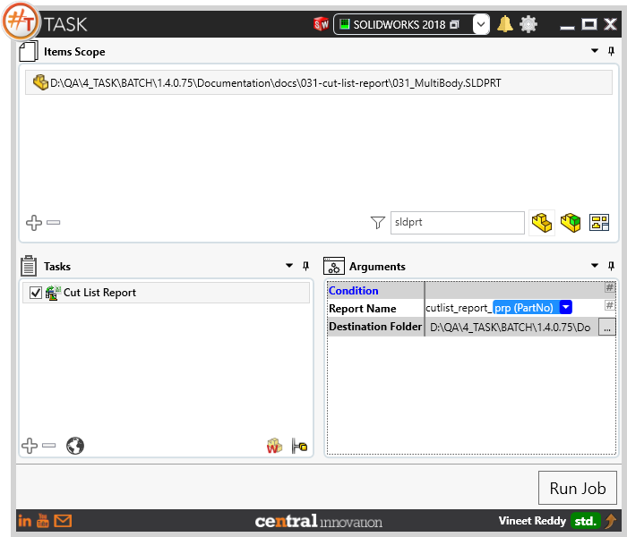
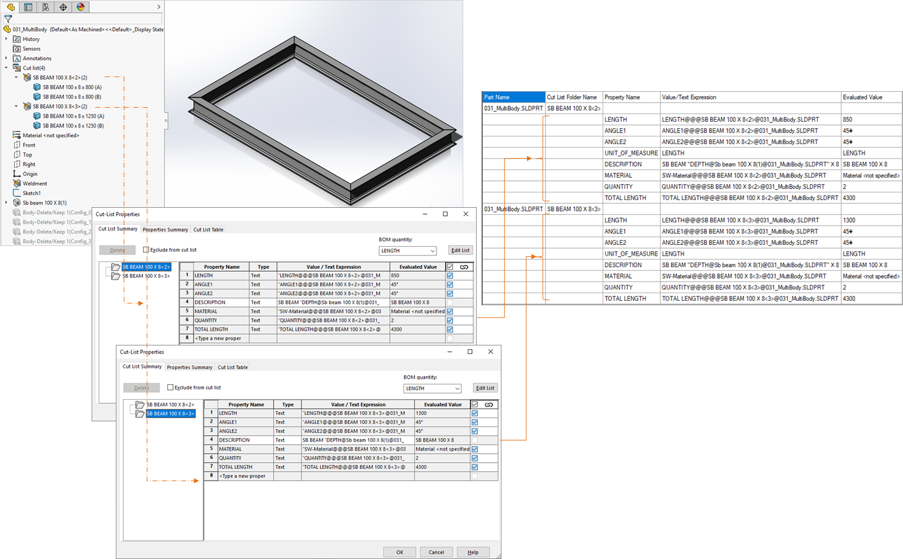
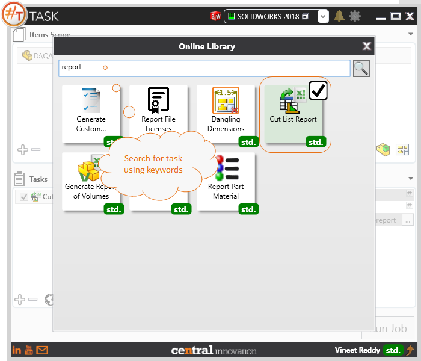

## Task Description

This macro processes the Cutlist table present in each Solidworks part file and saves it to a single output report as csv file (comma separated value). 
 - Default report name is set to "cutlist_report.csv". It may contain text or placeholders
 - User can directly enter the path to destination folder or use the browse control to choose one
 - It is recommended to enable "Open Read Only" setting

A comparative view of a drawing processed using Activate Sheet task is shown below.

## File Types

| Supported | Description |
| --- | --- |
| SLDPRT | Supports SolidWorks Part Files only |

## Download & Task Setup

User can download this task from online library performing search using keywords.

Select the task in Tasks list and setup arguments as required.

| Argument | Details |
| --- | --- |
| Report Name | Enter name of Sheet which needs to be activated. Alternatively, placeholders can be used |
| Destination Folder | Path to Folder where report has to be saved to               |

## Demo Video

<video width="720" height="480" controls>
  <source src="Sample.swf" type="video/mp4">
</video>

## Download Sample Files

Sample files can be downloaded from 
[Sample Model in Solidworks 2018](031-cut-list-report.zip)

