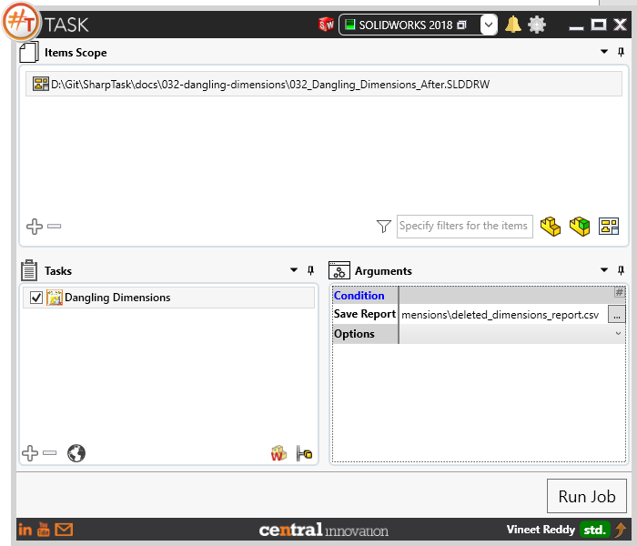
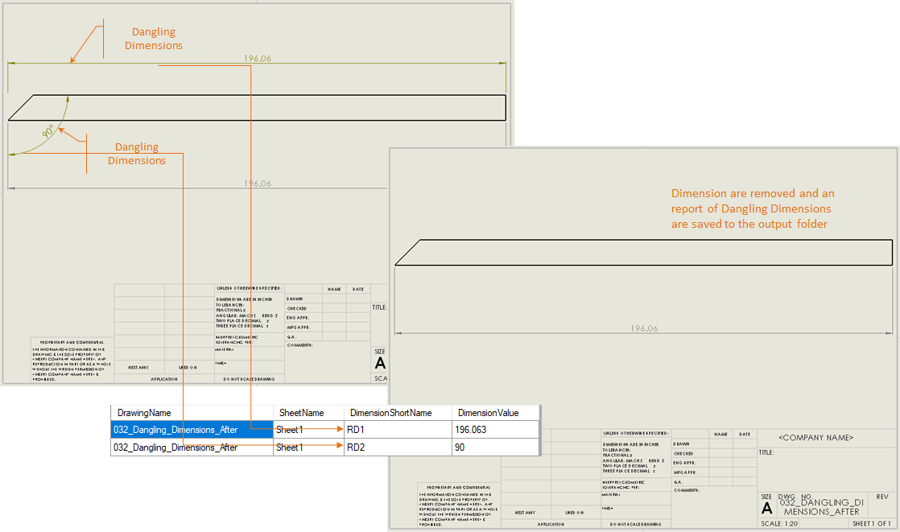
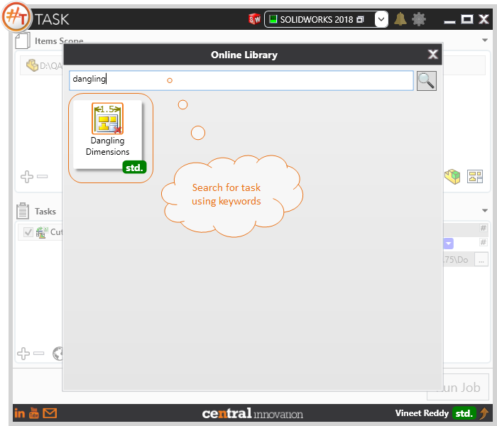

## Task Description

This task can be used to produce a report of dangling dimensions. User may also choose to remove these dimensions from the drawing sheet.
 - By default, a report name is present in the field, however user can specify a Report name with extension .csv (comma separated values). 
 - If user wants a report of such dimensions, then it can be set to 'Do Not Remove Dimensions'
 - Task works with Solidworks Drawing files only

A comparative view of a drawing processed using `Dangling Dimensions` task is shown below.

## File Types

| Supported | Description |
| --- | --- |
| SLDDRW | Supports SolidWorks Drawing Files only |

## Download & Task Setup

User can download this task from online library performing search using keywords.

Select the task in Tasks list and setup arguments as required.

| Argument | Details |
| --- | --- |
| Save Report | Full path to Output Report file (*.csv). |
| Options | User can select one or more options from pick list. User either leave the field empty which will delete any dangling dimensions from target drawings |
| Do not Remove Dimensions | When selected, `#TASK` will not remove dangling dimensions that were identifed |

## Demo Video

<video width="720" height="480" controls>
  <source src="002_ActivateSheet.swf" type="video/mp4">
</video>

## Download Sample Files

Sample files can be downloaded from [Solidworks 2018 Files](032-dangling-dimensions.zip)

