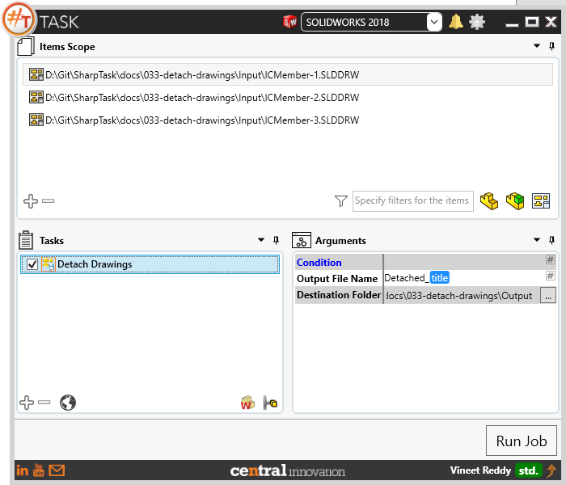
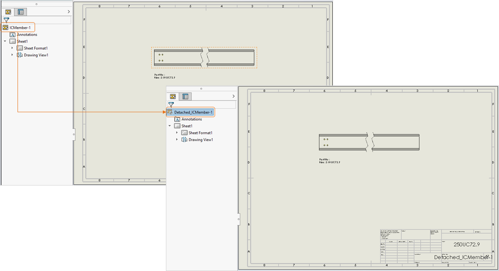

## Task Description

This task enables to save drawings as a new document and breaks the link to the reference model file. 
 - Works on both part and assembly drawing files
 - Can be used to share drawing files without sharing parametric model.
 - Output file loads faster than drawing with active link to the Solidworks Part [*.sldprt]

A comparative view of a drawing processed using Activate Sheet task is shown below.

## File Types

| Supported | Description |
| --- | --- |
| SLDDRW | Supports SolidWorks Drawing Files only |

## Download & Task Setup

User can download this task from online library performing search using keywords.

Select the task in Tasks list and setup arguments as required.

| Argument | Details |
| --- | --- |
| Output File Name | Enter a name for output file. Text can be manually entered and / or placeholder. |
| Destination Folder | Specify Path to the folder where detached drawings need to be output |

## Demo Video

<video width="720" height="480" controls>
  <source src="002_ActivateSheet.swf" type="video/mp4">
</video>

## Download Sample Files

Sample files can be downloaded from [Solidworks 2018 files](033_detached_drawings.zip)

