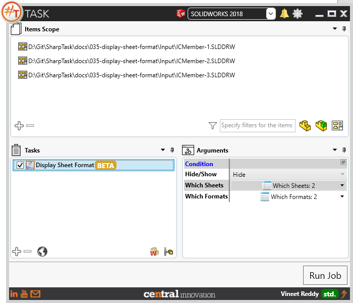

## Task Description

This task allows to hide/show sheet template on active drawing sheet. The visibility could be changed for all sheets on drawing by selecting an option in `#TASK` to run for each sheet. Optionally could be nominated specific sheets (by name, by number or by template) for which this task should work. If conditions were specified in several tables (`Which Sheets` and `Which Formats`) then the task will work only if conditions from both tables were met.

A comparative view of a drawing processed using `Display Sheet Format` task is shown below.

## File Types

| Supported | Description |
| --- | --- |
| SLDDRW | Supports SolidWorks Drawing Files only |

## Download & Task Setup

User can download this task from online library performing search using keywords.

Select the task in Tasks list and setup arguments as required.

| Argument | Details |
| --- | --- |
| Hide / Show | User can choose to either `Hide` specific sheet format or `Show` |
| Which Sheets | Using Table Control user can specify Sheet Name or Number. Match for Sheet name is exact |
| Which Formats | Using Table Control user can specify Sheet Format File. Multiple file paths can be provided using separate rows. When both values exist, #TASK will look into both settings and only when it finds Sheet Name/Number `and` Sheet Format file path to apply changes. |

## Demo Video

<video width="720" height="480" controls>
  <source src="002_ActivateSheet.swf" type="video/mp4">
</video>

## Download Sample Files

Sample files can be downloaded from [Solidworks 2018 files](035_display_sheet_format.zip)
