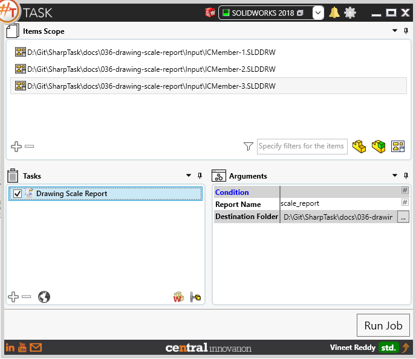
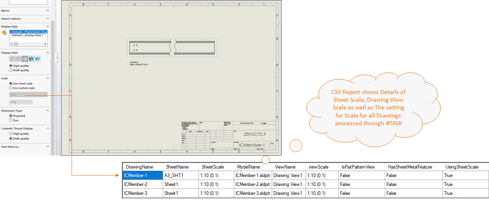

## Task Description



This task helps in generating a report containing scale ratio for each Drawing sheet and drawing view within the file. 
 - To improve readability, one blank row is inserted to mark the difference between two sheets and two blank rows are inserted to identify a new file. The output file is named as `ScaleReport.csv` by default, however user can change this.


A comparative view of a drawing processed using `Drawing Scale Report` task is shown below.



## File Types

| Supported | Description |
| --- | --- |
| SLDDRW | Supports SolidWorks Drawing Files only |


## Download & Task Setup

User can download this task from online library performing search using keywords.


Select the task in Tasks list and setup arguments as required.

| Argument | Details |
| --- | --- |
| Sheet Name / Number| Enter name of Sheet which needs to be activated. Alternatively, a sheet number can be specified |
| Options | User can select one or more options from pick list |
| Zoom to Fit | Sets the model to fit within SolidWorks layout. Similar to using ```Shortcut Key "F"``` within SolidWorks |


## Demo Video

<video width="720" height="480" controls>
  <source src="002_ActivateSheet.swf" type="video/mp4">
</video>


## Download Sample Files

Sample files can be downloaded from [Solidworks 2018 files](036_drawing_scale_report.zip)

