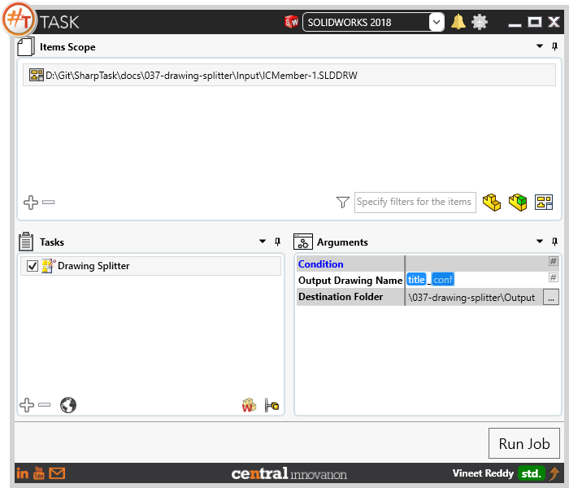
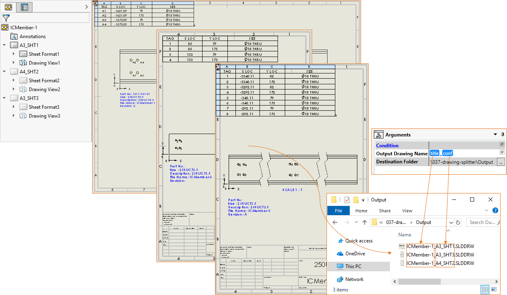
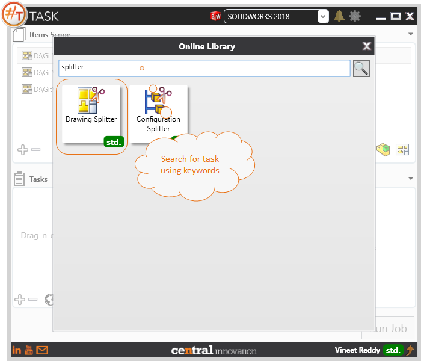

## Task Description

This task processes each drawing sheet and saves it as a new Solidworks Drawing file. 
 - The input drawing file is not modified.
 - Recommended to use "Open Read Only" setting in #Task
 - Use "Run macro on each configuration to save each sheet present in a multi sheet drawing as a separate Solidworks drawing file
 - By default, Output Drawing name is set as [title]_[configuration] and saved as slddrw format. It may contain text or placeholders
 - User can directly enter the path to destination folder or use the browse control to choose one

A comparative view of a drawing processed using Activate Sheet task is shown below.

## File Types

| Supported | Description |
| --- | --- |
| SLDDRW | Supports SolidWorks Drawing Files only |

## Download & Task Setup

User can download this task from online library performing search using keywords.

Select the task in Tasks list and setup arguments as required.

| Argument | Details |
| --- | --- |
| Output Drawing Name| Specify a name for the Drawing File using Text input. User can also choose to insert placeholders by accessing placeholder menu using `#` |
| Destination Folder | Full path to folder where drawings need to be saved to |

## Demo Video

<video width="720" height="480" controls>
  <source src="002_ActivateSheet.swf" type="video/mp4">
</video>

## Download Sample Files

Sample files can be downloaded from [Solidworks 2018 files](037-drawing-splitter.zip)

