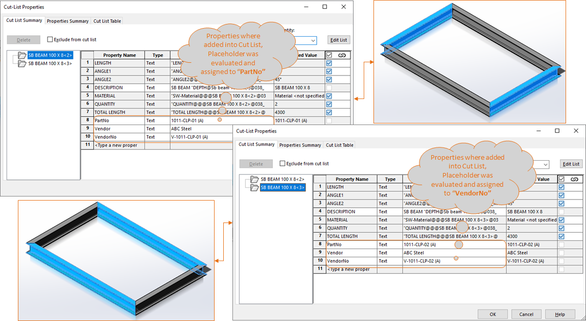

## Task Description

This task allows to add or remove cutlist properties. If the property with the same name was previously present then it will be overwritten while adding a property. Task works with SolidWorks parts only with cut list properties (e.g. weldment profiles, sheet metal). 

A comparative view of a drawing processed using `Edit CutList Properties` task is shown below.

Compare Cutlist Properties after processing through `#TASK`.

## File Types

| Supported | Description |
| --- | --- |
| SLDPRT | Supports SolidWorks Part Files only |

## Download & Task Setup

User can download this task from online library performing search using keywords.

Select the task in Tasks list and setup arguments as required.

| Argument | Details |
| --- | --- |
| Properties | Use Table control to Specify Properties to be added / removed into / from Cut Lists |

### Properties Table Control

| Options         | Details                                              |
| --------------- | ---------------------------------------------------- |
| Name            | User can enter a name manually as Text               |
| Value           | User can enter a Text value or can use placeholders  |
| Type            | Choose from `Text, Date, Yes/No, Number`             |
| Action          | Specify the required action. Default is "Add or Set" |
| Add or Set      | Choose when Custom Property is to be Newly Added     |
| Remove          | Choose when Custom Property is to be deleted         |
| Export to CSV   | Click to Export Table data into csv file             |
| Import from CSV | Click to Import Table data into csv file             |

<video width="720" height="480" controls>
  <source src="002_ActivateSheet.swf" type="video/mp4">
</video>

## Download Sample Files

Sample files can be downloaded from [Solidworks 2018 file](038_MultiBody.zip)
