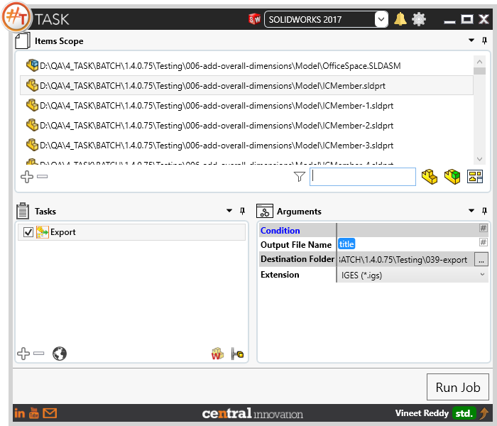
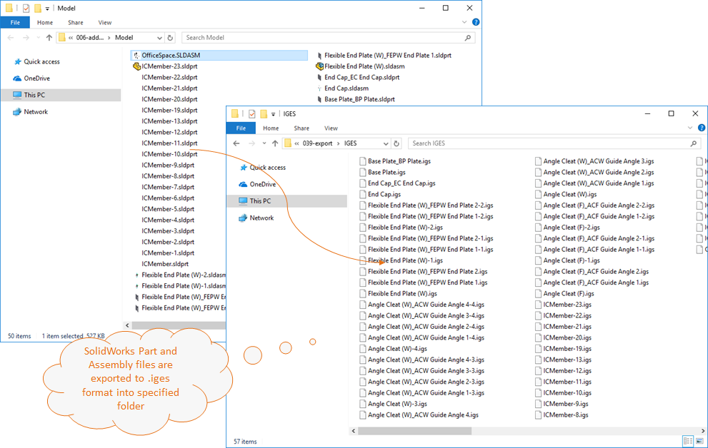
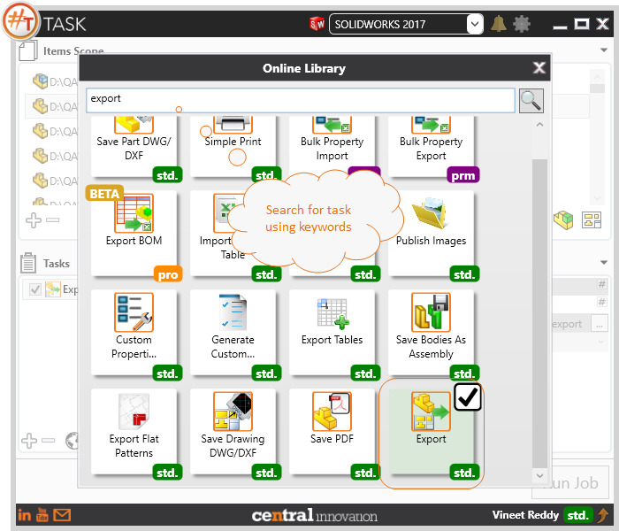

## Task Description



Task can be used to export Solidworks models with a specific output file naming using a single format or multiple formats within a single job execution.
 - Output File Name provides user the option to specify a text value directly
 - Destination folder path can be either typed in as text or user can choose the target folder using browse control.
 - The required output file type can be selected directly by user. Single or multiple output formats can be selected using the multi select control.
 - File formats available for export are step, igs, Parasolid, Parasolid Binary, STL,3D XML, Solidworks Part
 - Also provides to save the model as pictures in JPG and TIF formats.


A comparative view of a drawing processed using Activate Sheet task is shown below.



## File Types

| Supported | Description |
| --- | --- |
| SLDPRT | Supports SolidWorks Part Files|
| SLDASM | Supports SolidWorks Assembly Files|
| SLDDRW | Supports SolidWorks Drawing Files |

Note: *For details related to each output file format refer to the table in next section.*

## Download & Task Setup

User can download this task from online library performing search using keywords.



Select the task in Tasks list and setup arguments as required.

| Argument | Details |
| --- | --- |
| Output File Name | Enter Output Folder name as text or choose from one of the place holders (Click on `#` to access `Placeholders Menu`) to dynamically assign a value |
| Destination Folder | User can select one or more options from pick list |
| Extension | Sets the model to fit within SolidWorks layout. Similar to using ```Shortcut Key "F"``` within SolidWorks |

The list of file export formats and their supported Solidworks file types are summarized below.

| Export As                          | Supported Solidworks File Type(s)                         |
| ---------------------------------- | --------------------------------------------------------- |
| STEP (`*.step`)                    | `*.SLDPRT, *.SLDASM`                                      |
| IGES (`*.igs`)                     | `*.SLDPRT, *.SLDASM`                                      |
| Parasolid(`*.x_t`)                 | `*.SLDPRT, *.SLDASM`                                      |
| Parasolid Binary (`*.x_b`)         | `*.SLDPRT, *.SLDASM`                                      |
| STL (`*.stl`)                      | `*.SLDPRT, *.SLDASM`                                      |
| 3D XML (`*.3dxml`)                 | `*.SLDPRT, *.SLDASM`                                      |
| eDrawings (`*.eprt,*.easm,*.edrw`) | `*.eprt > *.SLDPRT, *.easm > *.SLDASM, *.edrw > *.SLDDRW` |
| Part (`*.sldprt`)                  | `*.SLDPRT`                                                |
| Tif (`*.tif`)                      | `*.SLDPRT, *.SLDASM, *.SLDDRW`                            |
| JPEG (`*.jpg`)                     | `*.SLDPRT, *.SLDASM, *.SLDDRW`                            |
| ACIS (`*.sat`)                     | `*.SLDPRT, *.SLDASM`                                      |

## Download Sample Files

Sample files can be downloaded from 
[Sample Model in Solidworks 2017](../000-model/SolidWorks_2017_RoboticArm.zip)

[Click to view the model at GrabCad](https://grabcad.com/library/5-dof-robot-1)
