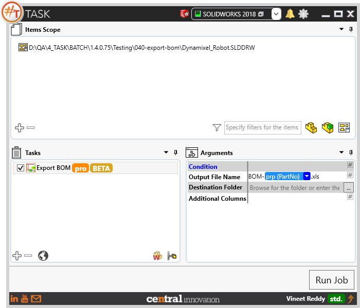
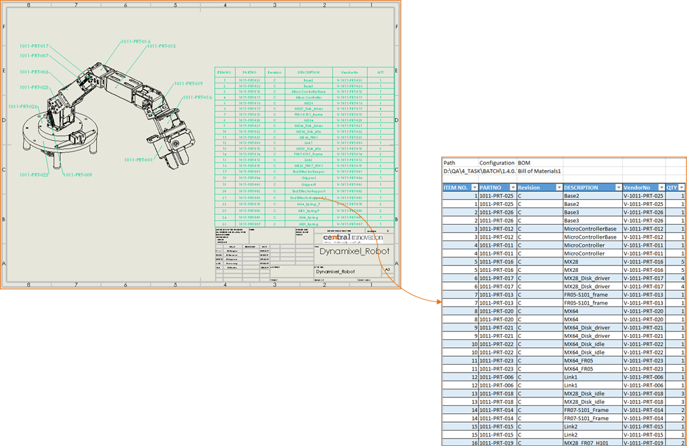
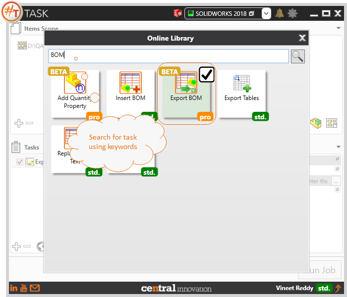

## Task Description

The task can be used to export Bill of Materials from Solidworks Drawing or Assembly files.
 - To export data, BOM table should exist
 - Allows user to Add Columns and Fill data using Placeholders
    Image: Captures Image of the Part within BOM Table. User can specify the Height and Width of the image. User can choose to capture Photo Realistic Images using PhotoView 360. View orientation can be set before capturing the image.
    Hyperlink: Hyperlink can be inserted to link each Item in the BOM table to its Part. User can choose to display specific text instead of  path to file

A comparative view of a drawing processed using Activate Sheet task is shown below.

## File Types

| Supported | Description |
| --- | --- |
| SLDDRW | Supports SolidWorks Drawing Files |
| SLDASM | Supports SolidWorks Assembly Files |

## Download & Task Setup

User can download this task from online library performing search using keywords.

Select the task in Tasks list and setup arguments as required.

| Argument | Details |
| --- | --- |
| Output File Name | Enter a name using text or setup dynamically using placeholder by accessing `#` |
| Destination Folder | Set a Folder path for the output file. If empty then output file will be created in same directory as Solidworks Drawing file |
| Additional Columns | User can select to add specific columns along with the the BOM Layout present in Solidworks Drawing file |
| Image | Image can be extracted from each model and saved against the row representing the selected Item Number in excel file |
| Hyperlink | Hyperlinks can be formed and saved against the row representing the selected Item Number in excel file |

## Demo Video

<video width="720" height="480" controls>
  <source src="002_ActivateSheet.swf" type="video/mp4">
</video>

## Download Sample Files

Sample files can be downloaded from 
[Sample Model in Solidworks 2017](../000-model/SolidWorks_2017_RoboticArm.zip)

[Click to view the model at GrabCad](https://grabcad.com/library/5-dof-robot-1)
