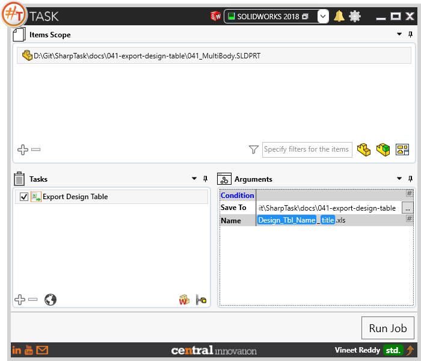
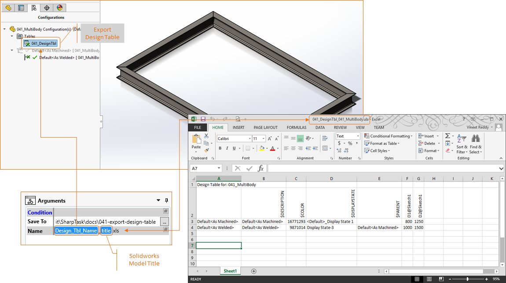
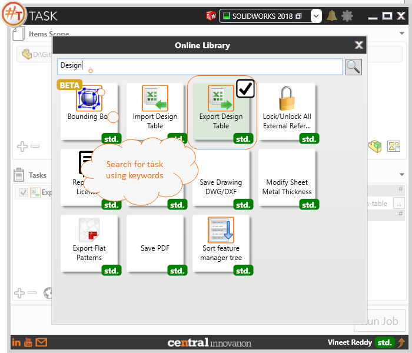

## Task Description

This task will help to export design table in excel format. 
 - User can specify a folder to save the output file
 - User can specify a file name either by typing in the output file name as text along with .xls extension.
    Can use placeholders likes Current Data, Design Table Name, Solidworks Title, Configuration Name and Custom Property Value
 - Task works with Solidworks Parts and Assemblies
 - Task works best with 'Import Design Table' as they can be used to quickly update variables.

A comparative view of a drawing processed using Activate Sheet task is shown below.

## File Types

| Supported | Description |
| --- | --- |
| SLDPRT | Supports SolidWorks Part Files |
| SLDASM | Supports SolidWorks Assembly Files |

## Download & Task Setup

User can download this task from online library performing search using keywords.

Select the task in Tasks list and setup arguments as required.

| Argument | Details |
| --- | --- |
| Save To | Specify folder path where Design Table as excel file should be saved to |
| Name | Enter a File name for exported design table. This can be text or made up of placeholders. Click on `#` to access the placeholders menu. |

## Demo Video

<video width="720" height="480" controls>
  <source src="002_ActivateSheet.swf" type="video/mp4">
</video>

## Download Sample Files

Sample files can be downloaded from [Solidworks 2018 file](041_MultiBody.zip)
