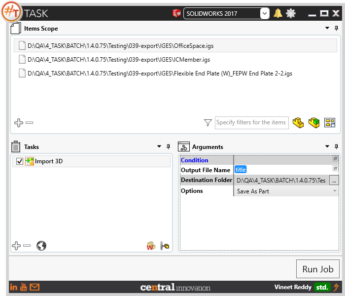
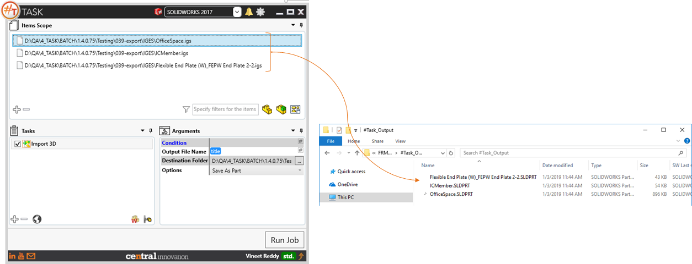
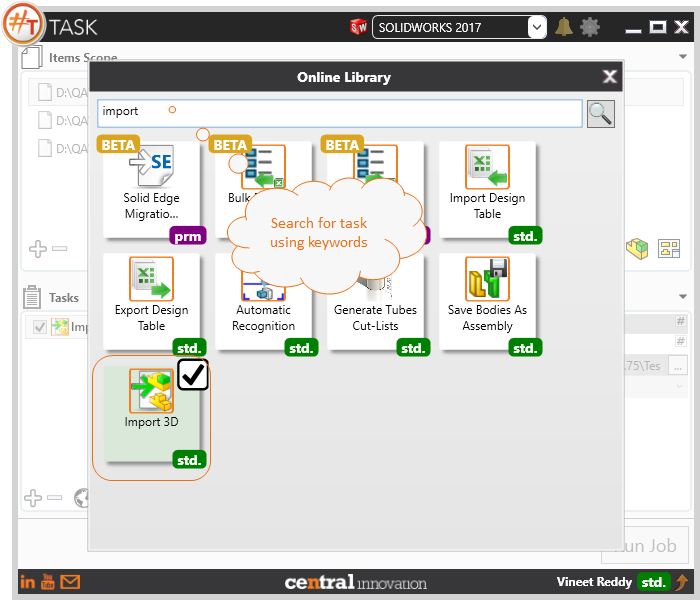

## Task Description

The task is useful in importing CAD Files from neutral format into Solidworks Native format. With multibody can be saved to Solidworks Part file by setting the import option in Solidworks to 'Import Multibody to Parts'.
 - Provides user with the option to Specify Output File Name. User can enter text as the Output File Name or can Construct it as Place Holders.
 - Destination Folder can be either selected using the browse control or the path to target folder can be specified as text
 - The following file formats are supported by this macro:  `*.step, *.igs, *.x_t, *.x_b, *.ifc, *.stl`
 - User can specify to import geometry as Part or Assembly

A comparative view of a igs files processed using Import 3D task is shown below.

## File Types

| Supported | Description |
| --- | --- |
| CAD Exchange Extensions | Supports SolidWorks Drawing Files only |
| | Drawing Exchange Format (.dxf) |
| | Drawing (.dwg) |
| | Adobe Photoshop (.psd) |
| | Adobe Illustrator (.ai) |
| | Parasolid (.x_t) |
| | STEP (.stp) |
| | ACIS (.sat) |
| | IGES (.igs, .iges) |
| | VDAFS (.vda) |
| | VRML (.wrl) |
| | STL (.stl) |
| | CATIA Graphics (.cgr) |
| | Pro/E Part (.prt) |
| | Pro/E Assembly (.asm) |
| | Unigraphics (.prt) |
| | Industry Foundation Classes (IFC) |
| | Inventor Part (.ipt) |
| | Inventor Assembly (.iam) |
| | Solid Edge Part (.psm) |
| | Solid Edge Assembly (.asm) |
| | CADKEY (.prt, .ckd) |
| | Add-Ins (.dll) |
| | IDF (.emn, .brd, .bdf, .ibd) |
| | Rhino (.3dm) |

## Download & Task Setup

User can download this task from online library performing search using keywords.

Select the task in Tasks list and setup arguments as required.

| Argument | Details |
| --- | --- |
| Output File Name | Enter name of Sheet which needs to be activated. Alternatively, a sheet number can be specified |
| Destination Folder | User can select one or more options from pick list |
| Options | User can choose to set output format as SolidWorks Part (`*.SLDPRT`) and / or SolidWorks Assembly (`*.SLDASM`) |

## Download Sample Files

Sample files can be downloaded from 
[Sample Model in Solidworks 2017](../000-model/SolidWorks_2017_RoboticArm.zip)

[Click to view the model at GrabCad](https://grabcad.com/library/5-dof-robot-1)
