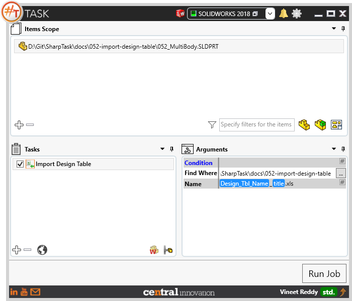
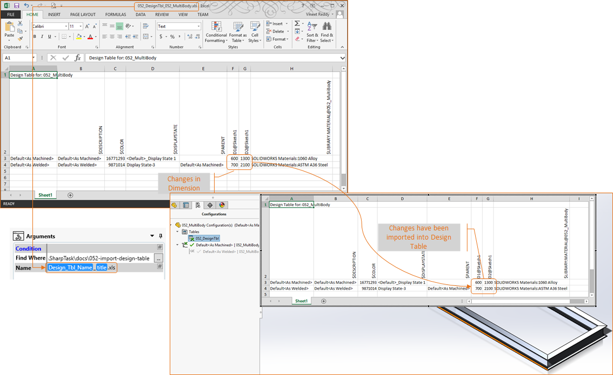

## Task Description

The task is used to import design table into Solidworks Part or Assembly. 
 - The file(s) against which it is executed should have a Design Table Feature existing in the Configurations Tab 
 - The task works best with `Export Design Table`
 - Excel can show additional popup messages which require user input during process. Pop up could be disabled using the method from this article   [Link to Microsoft]("https://support.microsoft.com/en-au/kb/948615" )
 - Task can works with Solidworks Part and Assembly files

A comparative view of a drawing processed using `Export Design Table` task is shown below.

## File Types

| Supported | Description |
| --- | --- |
| SLDPRT | Supports SolidWorks Part Files |
| SLDASM | Supports SolidWorks Assembly Files |

## Download & Task Setup

User can download this task from online library performing search using keywords.
Select the task in Tasks list and setup arguments as required.

| Argument | Details |
| --- | --- |
| Find Where | Specify the path to the folder where Design Table Excel File is placed |
| Name | Specify File name with extension to look for within folder path specified in`Find Where`   argument. User can type in file name as text or construct it dynamically using place holders by accessing menu using `#` button in this field |

## Demo Video

<video width="720" height="480" controls>
  <source src="002_ActivateSheet.swf" type="video/mp4">
</video>

## Download Sample Files

Sample files can be downloaded from [Solidworks 2018 files](052-import-design-table.zip)
