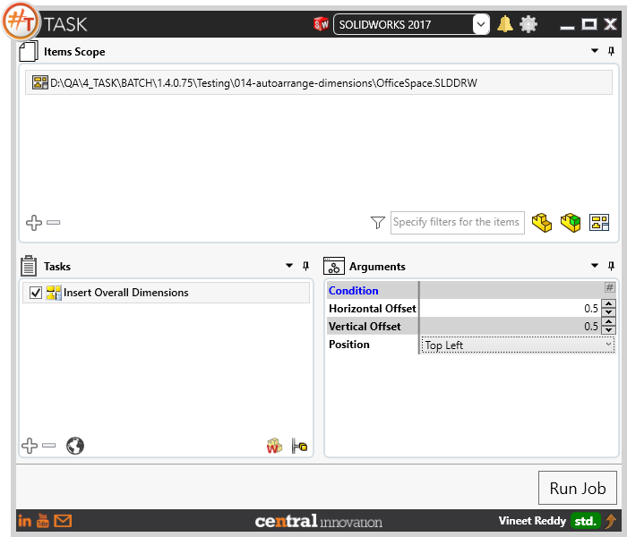
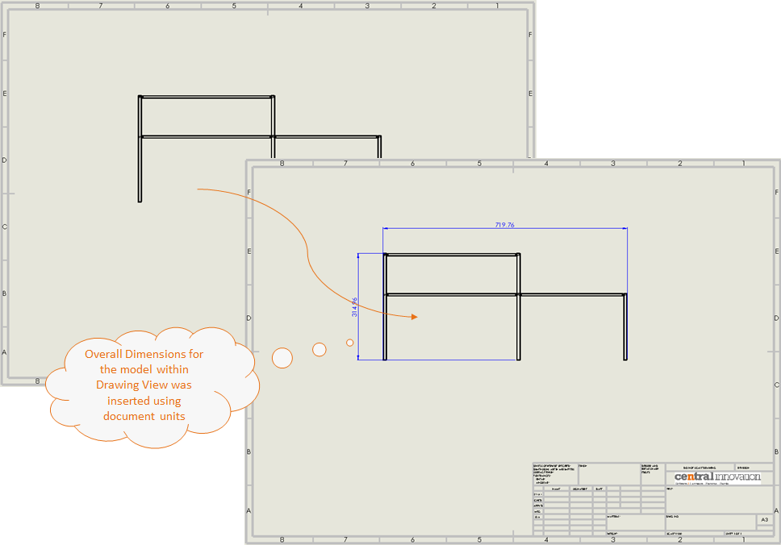
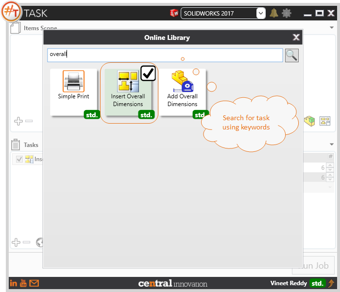

## Task Description



Task helps in dimensioning the model present within the drawing view against each sheet and it can traverse through all sheets. 
 - Provide user with option to set horizontal and vertical distance and also the Position where the dimension should be placed, Top Left, Top Right, Bottom Left, Bottom  Right
 - The units, decimal places and other settings are based  on document settings.
 - The tool will not identify if a dimension is already present and will insert a new one, hence overlapping it.
 - Axonometric views like Isometric, Dimetric and Trimetric will be ignored
 - Enable "Run on each Configuration"


A comparative view of a drawing processed using Activate Sheet task is shown below.



## File Types

| Supported | Description |
| --- | --- |
| SLDDRW | Supports SolidWorks Drawing Files only |


## Download & Task Setup

User can download this task from online library performing search using keywords.



Select the task in Tasks list and setup arguments as required.

| Argument | Details |
| --- | --- |
| Horizontal Offset | Specify the offset value between dimension leader and edge along x axis |
| Vertical Offset | Specify the offset value between dimension leader and edge along y axis |
| Position | Specify the style in which the text should be placed on leader. Available options are ```Top Left, Top Right,Bottom Left, Bottom Right```. `Top Left` will place the dimension value on ```top``` of  ```horizontal dimension leader``` and to the ```left``` of ```vertical dimension leader``` |


Click on "Run Job" to initiate.

Once Job is completed, overall dimension will be present for the model in drawing view.

Below is a video of demonstrating activate sheet task in usage

<video width="720" height="480" controls>
  <source src="002_ActivateSheet.swf" type="video/mp4">
</video>


## Download Sample Files

Sample files can be downloaded from 
[Sample Model in Solidworks 2017](../000-model/SolidWorks_2017_RoboticArm.zip)

[Click to view the model at GrabCad](https://grabcad.com/library/5-dof-robot-1)
