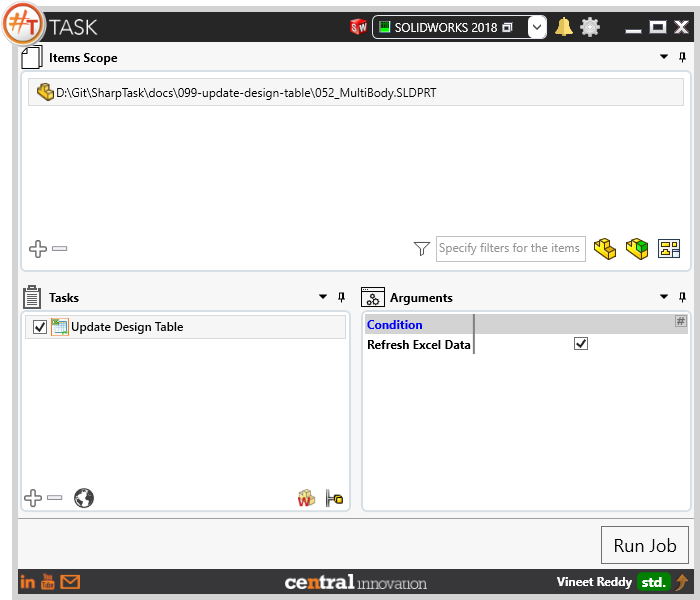
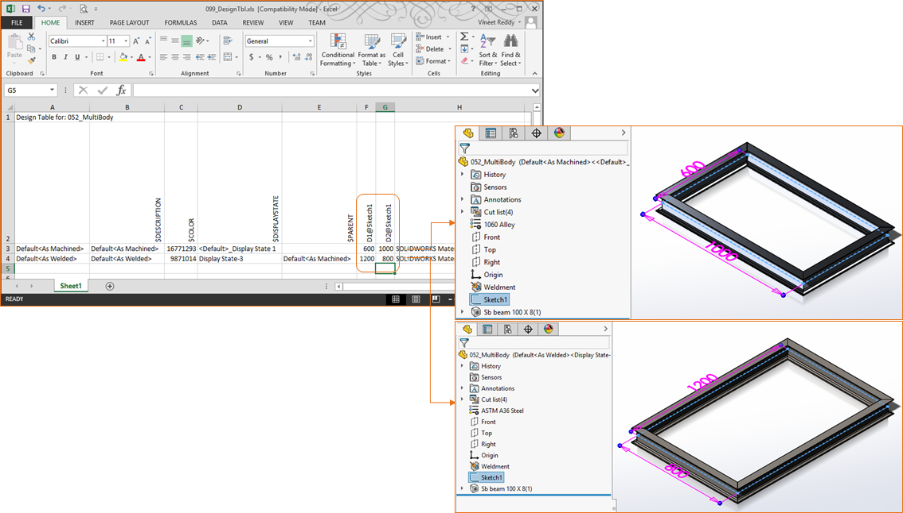
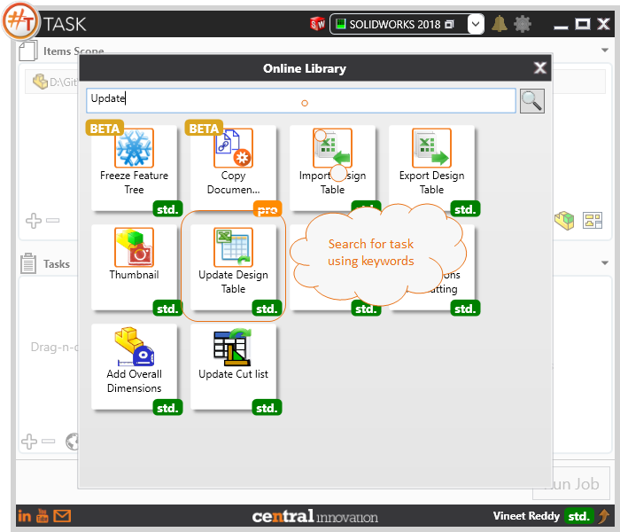

## Task Description

This task can be used to update the Design Table present within Solidworks Part or Assembly file.
 - The task only works when Design Table Feature is present in Configurations Tab.
 - User can choose to edit data in Excel file and then update Solidworks Model by enabling the Refresh Excel Data check box.

A comparative view of a drawing processed using `Update Design Table` task is shown below.

## File Types

| Supported | Description |
| --- | --- |
| SLDPRT | Supports SolidWorks Part Files |
| SLDASM | Supports SolidWorks Assembly Files |

## Download & Task Setup

User can download this task from online library performing search using keywords.

Select the task in Tasks list and setup arguments as required.

| Argument | Details |
| --- | --- |
| Refresh Excel Data | With the checkbox enabled, Design Tables present as external files and be used for editing and the same can be updated |

## Demo Video

<video width="720" height="480" controls>
  <source src="002_ActivateSheet.swf" type="video/mp4">
</video>

## Download Sample Files

Sample files can be downloaded from [Solidworks 2018 files](099-update-design-table.zip)

